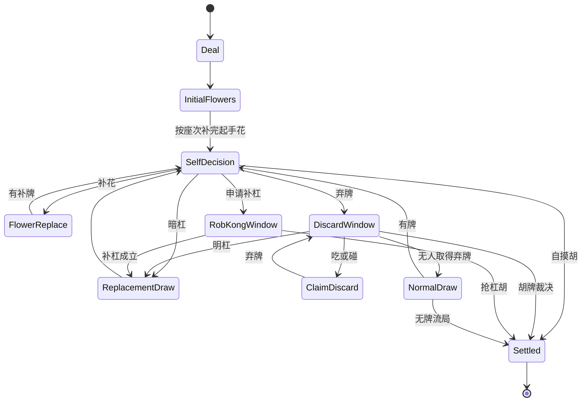
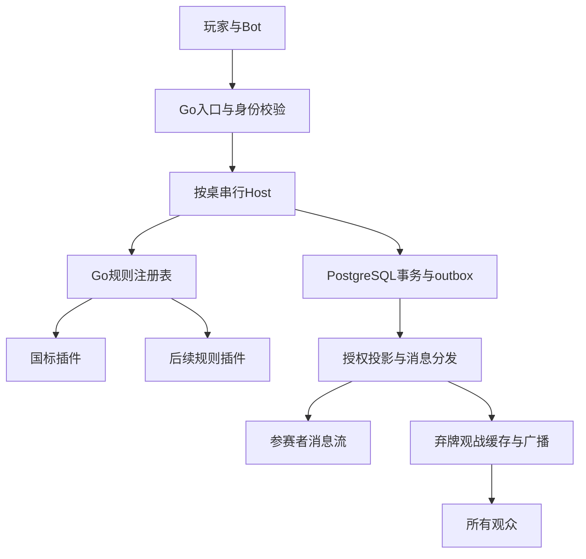

# OpenMajiang 完整首版产品与开发规格

版本：v0.1 完整首版规划稿（修订 3：Go／React／规则插件／开放观战）  
日期：2026-09-26（Asia/Shanghai）  
目标仓库：<https://github.com/yuebanhome/openmajiang>  
参考产品：<https://openpoker.ai/>  
状态：**已确认国标麻将、Go 后端、React 前端、规则插件、Docker 打包、GitHub Actions 自动构建推送；所有人可观战，但观众只能看到已打出的牌面。** 不做付费功能。本文保留已确认的开发规格与交付目标；当前实现进度及真实验证结果见 [最终目标](GOAL.md) 和 [验收记录](ACCEPTANCE.md)，本规格不代替运行证据。

本次取代旧稿的关键决策：邮箱账号完整闭环取代 GitHub 单一登录；邀请制仅限制入座；玩家信息流与弃牌观战流彻底分开；规则从 Go 插件加载注册；前后端由 Schema 协作，不再共用 TypeScript 裁判代码。第 5 节定义账号，第 10 节定义观战，第 11 节定义插件，第 15 节定义镜像与 CI。

## 1. 核心结论

第一版应做成一个**人和 Bot 都能参与、规则明确、可以稳定打完并复盘的开放麻将平台**。

首版的价值闭环是：真人能开桌邀请朋友，也能立即和内置 Bot 练习；开发者能接入自己的 Bot，与其他 Bot 或明确接受人机混玩的真人对战；每场对局都有结果、记录和故障定位依据。

按以下已确认方向和工程默认项执行规划：

1. **一套权威规则引擎，三种牌局模式。** 真人局、人机混合局、纯 Bot 局共用发牌、合法动作、裁决、计分和恢复机制。
2. **首版规则已确定为国标麻将（MCR）。** 采用 144 张含花牌、完整 81 个番种、非花牌番分至少 8 分起和及国标计分。以 WMO《麻将竞赛规则》2014 年第 2 版为规则来源，线上时钟和末张操作等补充单独版本化；标准赛程 16 手，短局仅作练习。不能用删减番种或无花模式代替该交付。
3. **Bot 是正式参赛身份。** 有归属人、版本、连接状态、战绩和权限，不能只是服务端随机出牌函数。
4. **外部 Bot 首选主动连接 WSS + JSON。** 开发者在自己电脑或服务器运行策略，不必开放公网回调地址；提供 TypeScript 和 Python 接入示例。
5. **免费完成闭环。** 不做会员、支付、充值、提现、房卡、奖金池、积分购买和任何可兑换资产。对局分只表示本场结果，允许为负，不存在“余额不足不能玩”。
6. **Go 后端、React + TypeScript 前端。** Go 模块化单体与 PostgreSQL 落地，前端构建后随同一应用镜像发布；Node 只用于前端构建与开发工具。
7. **规则插件是首版架构要求。** 采用 Go 接口、独立规则包和显式注册表；国标为第一个插件。平台不写死四人、单胡、连庄方式、番表或终局条件；新增规则需要实现插件与兼容 UI，不需要重写账号、房间、观战和 Bot 连接服务。
8. **任何人可以观战，牌面只显示弃牌。** 无账号、无邀请码也能看三类线上桌；所有旁观者均不能看手牌、摸牌、副露牌面、补花牌面及结算成牌，回放也不放宽。
9. **Docker + GitHub Actions 形成交付闭环。** PR 验证，main 和版本标签通过检查后自动构建推送 Docker Hub。使用用户已配置的 GitHub Environment `DOCKERHUB`，读取 `secrets.USER` 与 `secrets.TOKEN`；镜像按 digest 部署，提供数据库迁移、升级和回滚流程。

首版完成的判断：陌生游客无需注册即可看弃牌观战；普通用户能独立注册、找回账号、开桌、匹配、完成国标16手并复盘；一个人能和三个Bot练习，四个独立Bot能连续比赛；新增规则的测试插件无需修改平台裁决代码；CI能发布可在新机器运行的镜像。断网、重启、超时和重复消息不造成错牌、双重结算或信息越权。

## 2. 已核对的事实与参考边界

### 2.1 仓库现状

此前已通过 GitHub 读取默认分支 `main`，记录的检查点为提交 `bdfa5f04d87c9f3f50e885bc47f45b4e839ede6e`，提交时间 2026-09-26 14:29:13 +08:00。

| 项目 | 检查结果 | 对本次规划的影响 |
|---|---|---|
| README | `# openmajiang`，描述“一起打麻将” | 尚无具体产品或规则约束 |
| LICENSE | Apache License 2.0 | 后续代码、素材和依赖分别核对授权 |
| 根目录 | 仅 README.md、LICENSE | 没有现成客户端、后端、规则引擎或 CI 可沿用 |
| 技术栈 | 上述检查点尚未建立 | 用户本轮已指定 Go 后端、React 前端与 Docker／Actions |

本轮通过GitHub再次读取默认分支根目录，仍只列出README.md和LICENSE，尚无应用源码或`.github`工作流目录。Environment `DOCKERHUB`及其中`USER`、`TOKEN`的配置依据用户提供的信息；未读取密钥明文，也尚未执行登录/推送验证。本次交付为规格文档，没有向仓库提交代码、创建 PR 或部署服务。

### 2.2 OpenPoker 应该借鉴什么

本次核对了 OpenPoker 官方首页、Quickstart、Bot Builder、WebSocket 协议、状态同步及重连文档。以下为公开产品和接口层面的研究，**没有取得或审计它的服务端实现**。[S1–S7]

| 已核实的参考能力 | OpenMajiang 的对应设计 | 首版处理 |
|---|---|---|
| 模板 Bot 与自托管 Bot 两种入口 | 内置麻将 Bot；用户自己的 Bot 进程 | 两种都支持，模板先少而稳定 |
| WebSocket + JSON，语言无绑定 | 公开麻将动作协议 | 必须提供 |
| 创建 Bot、获得独立凭证、入桌自动对战 | Bot 控制台、连接检查、排队、邀请入桌 | 必须提供 |
| 浏览器观战、战绩和手牌记录 | 匿名弃牌观战、公开弃牌牌谱、本人视角复盘 | 全流程 P0，观众不获得任何其他牌面 |
| 动作授权、ACK、重连和状态恢复 | 麻将决策窗口、幂等指令、权威快照 | 按麻将语义重新设计 |
| 面向 AI 编程助手的完整协议文档 | `llms.txt`、`llms-full.txt`、Schema、可运行例子 | 随协议一起发布 |
| 赛季、排行榜及付费功能 | 日后可扩展的统计体系 | 首版只做对局统计和明确标注的测试榜 |

麻将不能直接照搬扑克轮流下注模型：一张弃牌可能同时触发多个人的响应，吃碰杠胡还有优先级；补杠存在抢杠；地方规则差异很大。因此应借鉴接入体验和平台闭环，按国标来源实现规则，另行明确线上补充与状态机。

## 3. 产品范围与首版入口

### 3.1 三种牌局模式

下表人数为国标插件的配置；平台座位数由插件 manifest 声明，未来三人玩法不要求改房间核心。所有线上模式均可匿名观战，包括邀请入座与 `self_test` 桌。

| 模式 | 座位构成 | 主要场景 | 必须限制 |
|---|---|---|---|
| 真人局 `human_only` | 4 位真人 | 好友约局、在线打牌 | 不自动把空位替换成竞技 Bot；断线托管必须显示 |
| 混合局 `mixed` | 1–3 位真人，其余为 Bot | 单人练习、朋友缺人、自研 Bot 陪打 | 开始前全员可见 Bot 身份和来源 |
| Bot 局 `bot_only` | 4 个 Bot | 接入调试、策略比较、连续对战 | 区分自测与公共匹配；固定每场的 Bot 版本 |

旁观者不占座位。每手的一个座位对应一个参赛身份；标准赛程换圈时按规则换座，参赛身份和累计分跟随人/Bot，真人断线后的临时托管不把战绩归属改成 Bot。

### 3.2 第一版界面

| 页面 | 首版必须具备的内容 |
|---|---|
| 大厅 | 立即练习、创建房间、输入邀请码、公开房间列表；显示模式、国标版本、赛程长度、人数 |
| 房间等待区 | 四个座位、邀请链接、准备、加入内置 Bot、选择自己的在线 Bot、规则说明 |
| 牌桌 | 自己手牌、他人手牌张数、牌河、副露、已补花牌、圈风/门风、庄家、剩余牌数、倒计时、动作按钮、自动补花设置、连接状态 |
| 结算 | 胡牌/流局原因、成立番种与排除说明、非花番分/花分/支付明细、累计分、继续下一手、结束本场 |
| Bot 控制台 | 创建、版本、凭证轮换、在线状态、当前牌局、启动/停止匹配、最近错误和战绩 |
| 对局记录 | 按人/Bot、规则、模式筛选；结果、关键动作和超时标记；进入复盘 |
| 复盘/观战 | 无登录入口、分享、弃牌河、播放/暂停/步进、回到实时、断线提示；明确弃牌视角；无操作权 |
| 账号 | 注册、邮箱验证、登录、找回、账户设置、设备会话、注销 |
| 规则目录 | 插件介绍、支持人数、规则版本、赛程、线上补充、Bot能力要求 |
| 运维后台 | 账号限制、Bot停用、房间故障、系统维护、规则开关、审计；不提供随意改分和全知看牌 |
| 开发者文档 | 快速接入、字段字典、鉴权、错误码、恢复流程、本地验证、语言示例 |

前端先做响应式 Web，桌面和手机浏览器可用；不把原生 App、小程序、3D 牌桌、语音聊天和复杂皮肤放入首版。牌面素材采用可追溯授权的静态 SVG/字体资源，保证小屏可辨认。

### 3.3 优先级

| 级别 | 内容 |
|---|---|
| P0：对外测试前必须完成 | 完整国标规则（144 张、81 番种、8 分门槛、16 手）、三种模式、房间与邀请、内置 Bot、自托管 Bot 接入、断线恢复、幂等动作、弃牌观战/公开牌谱、本人复盘、完整免费邮箱账号、Go规则插件、Docker/Actions、限流和运维 |
| P1：P0 稳定后增加 | 第二套正式麻将规则、GitHub OAuth、策略参数编辑、标准化 Bot 评测榜、LLM 适配示例、批量评测、授权复盘导出 |
| 后续另立项目 | 托管任意用户代码、上传模型、正式排位赛、赛事运营、多地区容灾、大规模反作弊分析 |
| 本版本排除 | 付费、钱包、兑换、充值、提现、奖金池、付费优先匹配、付费 Bot 配额 |

免费不意味着无限服务器资源。首版可统一设置：每账号 4 个自定义 Bot 配置，公共牌局最多 1 个在线参赛席位；邀请入座的 `self_test` 房允许该账号最多 4 个独立 Bot 同时参赛，限速的连续测试（批量评测产品列 P1）。这些是可调运维限额，不做付费解锁。内置练习 Bot 不占用户的自定义 Bot 名额。

### 3.4 首次访问、发现牌桌与匹配入口

首页直接展示正在进行、等待开局和最近结束的牌桌，提供「立即观战」「找人打牌」「创建房间」「接入 Bot」。游客进入观战不弹注册拦截；尝试入座、创建房间或创建 Bot 时才进入注册／登录，完成后回到原房间或原操作。房间失效时解释原因并回大厅，不自动加入另一场。

大厅按模式、规则插件、赛程、桌况、可入座状态筛选，默认优先展示活跃牌桌；每张卡片显示房间名、模式、规则及版本简称、标准 16 手／短局练习、真人与 Bot 标识、当前第几手、人数、是否需邀请才能入座。规则详情能查看完整版本与线上补充，不能只写「国标」。搜索可用房间号、房间名、玩家或 Bot 展示名，不搜索邮箱。首版不提供聊天、弹幕、私信和语音。

「快速加入真人桌」只匹配真人，不静默填 Bot；用户主动选择「与 Bot 练习」才能进入混合桌。真人队列按规则版本、赛程和时钟匹配，先保留座位并让四人确认，再进入房间准备；确认超时或取消则释放保留，不产生空比赛。一个真人只能处于一个入座保留、等待席位或活动场次中，不能多标签重复排队。Bot 队列独立运行，资格和同所有者限制沿用 Bot 规范，不与真人队列混用。

## 4. 首版规则：国标麻将（MCR）

### 4.1 规则基线、版本与适用范围

首个正式版本采用世界麻将组织（WMO）《麻将竞赛规则》2014年第2版，以中文条款为准，完整实现其行牌、和牌与81番种计分体系。官方分发文件名为 `MCR2021.pdf`，但版权页记载“2014年12月第2版第1次印刷”；文件名中的2021不作为规则版次。2006英文版仅用于交叉核对，不能覆盖所选中文基线。来源见 [S12]。

当前审阅副本来自协会镜像 `Greenbook2021_Chinese-EN.pdf`，其 SHA-256 为 `77220856f7d02a9d108cb4046038102ac46a9271ed2baf48b383cb13691be01c`。本次官方文件下载失败，尚未验证官方与镜像的哈希一致性。开发基线应保存该副本、来源URL、获取日期和校验值；官方文件恢复后核对差异，不得仅因同名而替换已发布比赛依据。

规则身份固定为：`ruleset_id = openmajiang.mcr`、`ruleset_version = 1.0.0`、`source_edition = wmo-mcr-2014-2nd`、`online_profile = om-mcr-1`。`match_format` 单独表达赛程，不能用规则版本暗示盘数。房间、比赛、Bot握手、牌谱和结算均携带这些字段，并记录裁判与算番库版本。发生影响合法动作、信息可见性或分数的变更时必须升版；已开始的比赛锁定原版本。

[S13] Botzone、[S14] PyMahjongGB 与 [S15] 裁判实现用于借鉴、交叉验证和接入适配，不能取代规则原文。第三方程序可能省略花牌、改变发牌或使用独立赛制，接入前必须逐项核对。首版不以简化胡型、删除番种或136张无花模式冒充完整MCR。

### 4.2 牌组、发牌、花牌与信息可见性

**本节的规则“公开”指向同场参赛者公开，不等于向互联网观众公开。** 国标玩家需看到的副露、补花及终局核验牌只进入参赛者视图；观众始终执行 `spectator_discard_only@1`，只展示曾经弃出的牌面，详见第 10 节。

使用144张：万、筒、条各36张，风牌16张、箭牌12张，八种花牌各1张。非花牌共34种、每种4张。花牌不参与顺子、刻子、对子及特殊和牌结构；暴露并补取的花牌独立记录，只有和牌者结算时按每张1分计入基本分。起和所需的8分不含花牌分。

发牌和补牌依据3.5.7：先完成原始配牌，庄家14张、其余各13张，再进入起手补花。按庄、南、西、北顺序，每位玩家完成自己的花牌补取；补来仍为花牌则继续，之后轮到下一位。起手流程完成前不能进入普通出牌或副露响应。庄家若达到合法和牌条件可和，否则打出第一张牌。在线洗牌、开牌和发牌的确定性映射需写入裁判说明，不能在不同版本间悄悄改变同一随机种子的结果。

普通摸牌从墙首拿取；补花及杠后补牌从墙尾拿取，遵循先上后下的补取次序。牌墙首尾共享同一剩余牌集合，每次取牌只消耗一张，不设日麻式独立王牌区。连续补花必须逐张记录，使回放能够重建墙长、补取来源和最后一张牌的上下文。

普通行牌时，规则允许未补的花牌直接打出。因此“自动补花”是可关闭的操作偏好，不能成为裁判强制规则。默认开启时，客户端按玩家偏好自动提交合法补花动作；手动模式与Bot协议保留补花或不补、随后依法弃牌的选择。起手补花仍按上述固定流程完成。自动偏好只决定代操作，不改变合法动作集合、得分或其他玩家获知的信息。

未宣告补花的花牌仍属于本人隐藏手牌，不得因其牌类特殊而提前广播。补花公开牌面、补花玩家与事件，补到的牌只对本人可见；弃花作为公开弃牌进入牌池，不能供他人吃、碰、杠或和。保留花牌不能据此形成有效和牌。暗杠在行牌期间仅公开暗杠事实及牌数，其具体牌面只对本人可见；该盘和牌或荒牌后仅向本场参赛者亮明供核查。普通隐藏手牌不因对手暗杠而额外公开。

### 4.3 合法和牌与完整算番

裁判必须同时验证牌张来源、结构、动作时点和起和分，不能把“14张可分组”直接等同于可和。杠的第四张及已补出的花牌不计入通常所称的14张结构；引擎用牌张守恒检查实际持牌数量，避免将四张杠子错误当作四张普通面子牌。

首版必须覆盖以下全部结构及其适用番种：

- 普通型：四组顺子、刻子或杠子，加一对将牌。
- 七对型：七个对子，包括符合条件的连七对。未开杠的四张相同牌可作为两对；2014版七对牌例明确允许计四归一，不能套用日麻“七种不同对子”的限制。
- 十三幺：幺九及字牌所组成的规定结构。
- 全不靠、七星不靠：按三种花色分别对应147、258、369的错开序数和字牌条件判定；七星不靠还需具备全部七种字牌。
- 组合龙：按规定的九张组合龙牌，加一组合法面子和一对将牌判定；允许范围内的副露和等候方式必须保留，不能仅支持全暗手。

全部81番种及原文规定的不计、并计和使用条件属于正式版完成范围。本节不复制完整番种表，开发应建立可定位到原文条款或牌例的机器可读定义与回归样例。无番和仅在满足其定义时计8分，不是给任何不足8分的成型手牌补足分数；七对、十三幺及不靠结构也必须走各自的排除关系。

算番须遵守不重复、不拆移、不得相同、就高不就低、套算一次等原则。先枚举合法分解及和牌张所归属的位置，再在每一种分解中检查番种兼容性，选取分值最高的合法组合。不能把不同拆法里各自最高的番种直接相加，也不能把同一组牌无限复用。平分时用固定顺序选择展示方案，保证同版本结果稳定。

同一手牌可以具有多种解释，和牌张落入刻子、顺子或将牌的位置会影响暗刻及等候番。引擎必须保存该张牌的独立身份，逐个解释核验，不能把点和完成的刻子一律当作暗刻，也不能仅凭排序后的十四张牌丢失自摸、点和和副露来源。七对中的四张相同牌只有未宣告为杠时才能按两对参与结构判断；已经开出的暗杠也不能在结算时撤回为七对。

参赛者结算返回有效番种、分值、涉及牌组及关键不计关系；观众结算只给结果和比分，不返回成牌、逐番牌组或拆分。门风、圈风、和牌来源、杠后补牌、补花、墙尾末张与已公开牌的信息均由裁判状态提供，不能让Bot自行声称。和绝张只根据当时可核验的已公开牌及该和牌张判断，包含本人此前公开的牌，不能读取隐藏手牌或未翻明暗杠牌面。补花后和牌可按条件计自摸；杠后补到花再补花而和，不能直接套用杠上开花。

### 4.4 行牌、响应优先级与杠

按逆时针依次行牌。仅下家可以吃上家的当前弃牌，碰或大明杠可以响应任意他家的当前弃牌。响应优先级为和牌高于碰／杠，碰／杠高于吃；同一弃牌只产生一个最终归属，等待响应结束后才提交副露和下一次摸牌。

同一张牌有多人可以和时，按弃牌者之后的行牌顺序取最近者，一盘只有一名和牌者，不启用一炮多响。放弃本次和牌只终止本次响应，不产生振听或持续的过和禁胡。规则允许吃、碰、和跟张，不能因玩家先前打过同种牌就拒绝其当前合法动作。

杠区分大明杠、加杠和暗杠，并统一处理杠后补牌。吃或碰之后的这一次行动不能立即加杠或暗杠，须再次拿牌后才有开杠资格。加杠先进入抢杠响应，只有无人合法抢和才完成加杠并补牌；有人抢和时保留原明刻，新增那张作为和牌张处理，不能既计入杠又计入和牌。首版抢杠按基线对应加杠，不引入抢暗杠的地方例外。

吃、碰后允许打出与吃进或碰进相同的牌，不额外增加食替限制。杠本身不触发即时收取对手分数；其价值在合法和牌的番种结算中体现。不能引入杠分、连庄加成、宝牌、立直棒、查大叫或查花猪等其他玩法机制。

### 4.5 四圈16盘赛程与座位轮换

正式赛程为 `match_format = standard_16`，完整打完东、南、西、北四圈，每圈四盘，共16盘。本文的“手”与国标原文的“盘”同义；协议使用 Hand 表示一次发牌到和牌或荒牌，“圈”表示四人各坐一次庄，“局／比赛”表示本次16盘赛程，避免日常口语中的“局”混用造成统计错误。

采用附件四的换座表。服务器在每场开始时随机安排四名参赛者的初始桌位，结果写入Match。令A、B、C、D为第一圈起始时东、南、西、北座的四名玩家；下表中的方位是固定桌位，不能当成整圈不变的门风：

| 圈风 | 固定东座 | 固定南座 | 固定西座 | 固定北座 |
|---|---|---|---|---|
| 东风圈 | A | B | C | D |
| 南风圈 | B | A | D | C |
| 西风圈 | C | D | B | A |
| 北风圈 | D | C | A | B |

每圈首盘由该圈固定东座玩家坐庄；圈内庄位逐盘向南、西、北座推进。庄家的门风为东，其后按行牌顺序分别为南、西、北，门风随盘变化。无论庄家和牌、闲家和牌还是荒牌，都推进下一庄位，不连庄。圈末先更新玩家与固定桌位的映射，再开启下一圈首盘。玩家身份和累计分数始终跟随玩家，不能跟随座位迁移。

`standard_16` 不启用整局150分钟上限，必须完成16盘；单次动作的超时和断线托管由平台规定。此为线上赛程适配，区别于线下规则3.5.6所规定的每局不超过150分钟，不能宣传为原样复刻全部线下赛事流程。

另提供 `practice_1`、`practice_4` 单盘或单圈练习，沿用相同牌理和算番规则，但单独记录战绩、胜率及榜单，不并入正式16盘排名。跨规则版本、线上补充版本或赛程的结果，未经标注不得混合用于排行榜和Bot强度比较。

### 4.6 分数支付与算例

令 `H` 为合法番种分值之和且不含花牌，`B` 为和牌者有效花牌分，先检查 `H >= 8`；合法后基本分 `F = H + B`。每位未和牌者向和牌者支付8分底分，自摸和点和按下表结算：

| 和牌方式 | 和牌者净得分 | 其余玩家净得分 |
|---|---|---|
| 自摸 | `3 × (8 + F)` | 三家各 `-(8 + F)` |
| 点和／抢杠和 | `24 + F` | 放铳者／被抢杠者 `-(8 + F)`，另两家各 `-8` |

例如非花8分、有效花牌2分，基本分为10分：点和时四人变化为 `+34、-18、-8、-8`；自摸时为 `+54、-18、-18、-18`。非花7分加2张花仍不可和。计分使用相加分值，不把“番”实现成二次幂翻倍；庄家没有额外支付倍数，负分不导致提前淘汰。

无和牌的荒牌不转移分数。首版由服务端拒绝诈和、错牌等非法动作，不照搬线下人工报牌错误的处罚流程；网络滥用按平台规则处理，不在比赛分中暗加罚分。因此，每盘四人的净变化总和必须为零，16盘累计按玩家身份求和。UI同时展示非花分、花牌分、底分与实际收支，便于解释同一牌型在自摸和点和时的差别。

完整16手按累计比赛分排位，标准分为第1至4名分别4、2、1、0分；它与逐手比赛分分开存储。并列时平分所占名次的标准分（例如并列第一各3分，其后第三1分、第四0分），以精确有理数记录并在UI合理显示；该并列处理写入平台赛程约定。练习和提前终止场次不发标准分。

### 4.7 OM-MCR-1线上补充与规则边界

绿皮书之外的末张行为存在赛事解释差异。例如第七届世锦赛补充细则允许最后一张摸入后加杠、暗杠或补花，见[S16]。首版采用下列 **OM-MCR-1平台赛事补充**，公开写入房间规则与牌谱；这些取舍不宣称为所有MCR赛事的统一规定：

1. 牌墙没有可补牌时，不允许宣告大明杠、加杠、暗杠或补花。摸入最后一张后，仅保留符合条件的和牌与合法弃牌动作；最后一张为花牌时可弃花，不能凭空生成补牌。
2. 末张弃牌仅接受和牌或过，不再允许吃、碰或杠。响应完成后，如无合法和牌则判荒牌；不可刚摸完末张就跳过弃牌和响应直接终局。
3. 末张仍有多人和牌时继续使用顺序最近者优先的单和规则；妙手回春、海底捞月及相关番种依所锁定规则与实际事件判断，不把“最后一张牌种”误认为“牌墙最后一张”。
4. 裁判在提交动作前校验完整合法性。客户端和Bot收到同一视角下的合法动作约束；自动补花、托管和超时回退不得越过无可补牌限制。无法表示、参数不匹配或过期动作按平台协议拒绝并记录，不能部分修改牌局。

每盘事件还应分别保存发牌、普通摸牌、杠后补牌和补花补牌的来源，区分当前剩余墙长与该事件发生前的墙长。回放不得仅根据最终手牌猜测末张番种；断线恢复应返回玩家当时可见的状态，不能提前携带盘末才允许公开的暗杠牌面。以上信息边界同样适用于观战与训练数据导出；首版不提供线上全知复盘或全知数据导出。

M0须将上述主基线、赛程适配与平台补充拆分登记，建立条款到实现和样例的对应关系。发布前至少覆盖七对四归一、花牌不够起和分、未补花弃牌、连续补花、抢杠撤销、吃碰后禁止杠、末张响应、暗杠保密与终局亮明、四圈换座及支付守恒等关键场景。裁判和算番库出现差异时回到已冻结原文与补充条款裁决，不以某个现成库的输出自动修改产品规则。

## 5. 注册登录、账号、核心对象与权限

### 5.1 核心对象与授权原则

| 对象 | 定义 | 生命周期原则 |
|---|---|---|
| User | 登录账号、Bot 所有人 | 不等于牌桌座位 |
| Participant | 参赛身份：人或某个 Bot | 每场固定身份与显示类型 |
| Bot / BotVersion | Bot 身份与不可变策略版本记录 | 入场绑定版本；线上外部代码无法仅靠版本声明验证一致性 |
| Room | 房间、规则、模式、访问策略、等待区 | 可承载多场比赛；有人离开不抹掉记录 |
| Match | 插件声明的match_format；国标为 `standard_16` / `practice_1` / `practice_4` | 固定参赛者、规则来源、线上补充、赛程与时钟配置 |
| Hand | 一次发牌到胡牌/流局 | 拥有独立墙序、事件、决策及结算 |
| Seat / SeatAssignment | 每手0至seat_count-1座位与参赛者映射；国标为0–3 | 手内固定；换圈按表换座，累计分按 participant_id 归属；不允许中途换参赛者 |
| Controller | 当前控制座位的连接或托管器 | 与参赛身份分离；切换带 `control_epoch` |

首版采用邮箱与密码账号。匿名用户可看大厅、规则、观战与公开弃牌牌谱；所有线上入座、建房和 Bot 管理均需验证邮箱。立即练习也遵循这一入座门槛，注册完成后返回原练习入口。GitHub OAuth 列 P1。

公开真人房的“真人”表示用户使用真人客户端且平台没有安排竞技 Bot，首版不能保证用户没在外部使用 AI 辅助。

**权限必须由服务端校验：**

- 房主只能在开场前配置桌规、踢出等待者和添加内置 Bot；不能替别人确认动作、查看他人手牌或中途改分。
- 用户只能操控自己的参赛身份；Bot 凭证不能管理账号、轮换其他 Bot 的密钥、操控另一个座位。
- 邀请房邀请码仅代表申请入座的能力，入座后仍需会话和席位授权；任何人观战都不需要邀请码；邀请链接不能包含长期 API Key。
- 同一参赛身份只允许一场进行中的对局；同账号在公共队列不能以“自己 + 自己的 Bot”或多个自有 Bot 同桌。
- 邀请入座的自测房可显式允许同所有人多 Bot，必须标记 `self_test`，不进入公共对比统计。

### 5.2 免费账号生命周期

首版默认邮箱＋密码注册，GitHub OAuth 列为 P1；不把开发者平台账号当作普通玩家的唯一入口。注册填写邮箱、密码和展示名，同意服务条款后发送验证邮件。未验证账号可继续公共观战，但不能入座、建房或注册 Bot。验证链接须一次性使用且有有效期，提供重发、冷却、失效后重发和邮箱填错后的重新提交流程；对已授权的验证流程和运维提供投递失败状态；未认证请求不因账号是否存在显示不同失败结果，也不能承诺邮件已到达收件箱。

登录、验证码重发和找回密码使用不泄露账号存在性的文案并限流。找回密码从邮件单次链接设置新密码，成功后撤销旧登录会话。未认证登录统一显示凭据或请求不被接受；只有正确密码验证后、已授权待验证会话内或运维侧，才展示邮箱未验证、账号受限及可操作的具体恢复提示。会话过期只说明当前会话失效，不披露他人账号状态。注册不能依靠展示名作为账号唯一标识；历史、计分和权限均绑定不可变的用户 ID。

账号页支持修改展示名、修改密码、改邮箱、列出登录设备／最近活动和退出其他设备。改邮箱需近期重新验证身份及验证新邮箱，完成前旧邮箱保持有效，完成后给旧邮箱安全通知；不能只凭一个长期登录 Cookie 更改账号归属。退出当前设备撤销该会话及其玩家连接；退出其他设备撤销所选会话及连接，当前设备保留。多标签可看同一账号，但同一席位只允许一个控制租约，切换控制端有明确提示并使旧控制端失效。

注销要求重新验证身份；有活动比赛时先按退场流程处理，避免删除仍在记分的身份。注销撤销所有会话、Bot 密钥和 Bot 排队任务，并删除或去标识化邮箱等个人资料。已发生的对局、牌谱、比分和必要审计记录保留稳定参赛者引用，公开展示改为「已注销用户」，不得把用户 ID 分配给新账号。保留范围与期限在账号页说明；注销不改写对手战绩，也不抹去已向其他参赛者公开的牌局信息。

### 5.3 权限矩阵

| 身份 | 公共大厅／观战／公开牌谱 | 入座与动作 | 房间管理 | 私有资料与 Bot 管理 |
| --- | --- | --- | --- | --- |
| 游客 | 仅弃牌观战，受合理限流 | 不可 | 不可 | 无 |
| 已验证账号 | 未参赛时同游客，仅弃牌观战 | 满足模式及入座策略后可申请 | 可创建房间 | 仅本人资料、会话和本人视角历史 |
| 当前玩家 | 可读；主动打开观众接口仍仅弃牌 | 仅当前席位授权及有效控制端 | 无额外权限 | 参赛者视图：本人手牌、合法动作及规则允许的对手信息；手末依已选国标规则核验成牌与暗杠 |
| 等待区房主 | 可读 | 同普通玩家 | 开局前配置、邀请、移除未开局席位、加允许的 Bot | 不因房主身份看到其他人暗手 |
| Bot 所有者 | 可读 | Bot 经自己的运行会话及席位授权行动 | 可管理自己的 Bot 入座／排队 | 仅自己 Bot 配置、版本、密钥和授权视角记录；不能读取同桌他人暗手 |
| 运维管理员 | 可读 | 不直接代玩家出牌 | 可因运营原因停止匹配、限制账号或中止故障桌，并留下原因 | 后台默认无全知牌局浏览；受控故障调查另设审计权限 |

房主身份与比赛裁判分离：开局后不能改规则、踢人、换 Bot、重发牌或改分。Bot 的运行凭据、HTTP 管理权限和观战票据互不替代；Bot 所有者不能用观战接口请求自己的私有牌面，私有资料必须走显式授权接口。是否参赛按具体场次判定，不能因为曾在同一房间打过牌而获得后续场次的参赛者视图。未验证账号的行为权限按游客处理，但可以管理验证流程及退出账号。

### 5.4 账号实施约束与邮件依赖

| 项目 | 首版明确约定 |
|---|---|
| 密码 | 15–128字符，允许空格和密码管理器粘贴；不做无理由定期强制修改；只存Argon2id随机盐哈希，参数按服务器压测固定并可迁移，不存明文或可逆密文 |
| 邮箱凭据 | 验证/找回各自独立的随机单次token，仅存哈希；验证24小时、找回30分钟是本项目默认值；重发冷却60秒并有账号/IP额度 |
| 链接消费 | 邮件链接GET只展示确认页，POST确认才消费token；不让邮箱扫描机器人自动完成验证/重置；链接不进入分析日志 |
| 会话 | 服务端存储的随机会话ID，浏览器用Secure、HttpOnly、SameSite Cookie；状态变更校验CSRF及Origin；不把长期凭据放localStorage |
| 会话撤销 | 改密码、找回成功、注销撤销全部真人会话并关闭关联玩家WS；Bot运行凭据与真人会话独立，疑似账号泄露时提供“一并撤销全部Bot密钥”明确操作；注销必须全部撤销 |
| 邮件发件 | SMTP为首版必需运行依赖；事务outbox异步发邮件，展示“已排队/请查收”，SMTP接受不等于已到达收件箱；退信/重试失败可诊断，不能静默丢邮件 |
| 账号公开信息 | 展示名、默认头像、公开ID及用户选择的简介；邮箱、IP、设备标识、会话历史不出现在大厅/观战/公开资料 |
| 运维权限 | 普通用户与operator独立角色；管理员首次授权由部署CLI对已验证账号操作，禁止公开注册时选择管理员；管理写操作记录操作者、原因和结果 |

密码、会话和找回流程参照OWASP官方清单[S20]；上表有效期和额度属于项目默认配置，部署前验证邮件链路与恢复流程。首版不做头像文件上传，使用内置头像，避免把无关文件系统能力塞入注册流程。

## 6. 真人牌局与房间流程

### 6.1 从进入到结束

1. 创建房间：选择真人/混合/Bot 模式、开放入座或邀请入座和赛程（观战对所有人开放）；好友/公共桌默认 16 手，立即练习默认 1 手。展示规则来源、线上补充与计时。
2. 加入座位：邀请朋友，或在混合房空位添加内置 Bot；自己的外部 Bot 必须已连接且规则兼容。
3. 全员准备：真人手动准备，在线 Bot 通过 ready 确认；服务器按插件seat_count检查席位齐全、身份不冲突、模式合法。
4. 开始一场：冻结规则、线上补充、时钟、赛程、参赛者、换座表、Bot 版本和入座策略；产生 Match 与第一手席位授权。
5. 正常打牌：客户端只展示服务器提供的合法操作；服务端接收指令、校验并发出结果。
6. 每手结算：显示成立番种、非花番分、花分、胡牌来源、各家支付和分数变动，允许查看这一手的本人视角记录。
7. 手间阶段：真人/混合桌给 15 秒查看结果，Bot 桌给 1 秒；该阶段结束时，任何参赛者请求退出或仍未恢复连接，都终止剩余赛程，标记 `ended_early`，保留已完成手的分数。全员在线且无人退出才发下一手；换圈时先更新座位映射、门风/圈风和席位授权，再发牌。
8. 场次结束：完整 16 手场次展示累计比赛分、名次和标准分；短练习场只展示练习累计分及名次，提前结束只展示已完成手的分数及原因；真人“再来一场”重新准备，规则或成员变动只在此时进行。

低流量阶段以好友邀请码、房间列表和“立即练习”优先，同时交付基础真人快速匹配与Bot队列。队列按规则插件精确版本、配置hash、赛程和时钟分池；不同模式不静默混排，不做段位匹配。

### 6.2 离开、断网和控制权

| 情况 | 处理 |
|---|---|
| 开局前离开 | 释放座位；准备状态重置 |
| 正常连接中超时 | 当前决策执行统一兜底；显示超时标记 |
| 真人断网 | 原倒计时继续；到期托管；座位和战绩归属保留 |
| 用户回来 | 获取自己的最新快照；若当前决策尚未登记，显式“接管”后更换控制权世代；已登记动作不能撤回 |
| 主动离开本手 | 标记 `leave_after_hand`，本手托管打完；手间终止剩余赛程，在线成员返回等待区 |
| 同账号另一窗口 | 默认只读镜像；只有显式接管才能废止旧控制连接 |
| 房主断线 | 不暂停牌局；房主管理权在手间转给最早进入的在线真人，无真人则归系统 |
| 全部真人离线且没有需继续的外部 Bot | 当前手用兜底完成，手间关闭房间；避免无人桌永久运行 |
| Bot 全部离线 | 同样完成当前手，结束当前测试场并显示中断原因 |

托管器是保底控制器，不冒充用户原来的策略；记录托管覆盖的决策数，方便判断战绩是否可比较。

### 6.3 超时策略

以下为 OpenMajiang 的线上时钟配置，不宣称等同线下比赛报牌时限。入场后固定，实际体验测试后可版本化调整；它与国标规则来源版本分别记录：

| 参数 | 真人/混合桌 | Bot 标准桌 |
|---|---:|---:|
| 自己摸牌/补牌/吃碰后决策 | 15 秒 | 2 秒 |
| 弃牌/抢杠响应窗口 | 4 秒 | 500 毫秒 |
| 手间展示 | 15 秒 | 1 秒 |
| 持续断线限制 | 当前手保座位，手间处理退出 | 当前手保座位，手间从公共队列移除 |

所有座位以房间时钟为准；混合桌的 Bot 不获得额外思考时间。高延迟 LLM Bot 使用邀请入座的慢速测试房（同样允许弃牌观战），不能让公共标准桌随请求临时延时。

兜底规则：响应窗口选择过；自己回合若有满足 8 分门槛的合法自摸胡则胡，否则有合法补花选项时补花，再优先弃刚摸入的牌，没有摸入牌时按固定牌种顺序选择一张合法弃牌；兜底不主动吃碰杠。普通摸牌后补出非花牌不重置原行动截止时间；连续补花逐次校验并记录，自动控制器只提交合法选项，有限花牌数保证流程终止；起手补花在首个行动时钟启动前完成。无法补出的花牌可作为弃牌，不能卡住牌局。不得以随机非法动作或无限等待处理超时。

### 6.4 房间生命周期与竞态处理

首版房间依次为等待入座、等待准备、比赛进行、展示结算或关闭；每间房对应一场比赛。再来一场创建同配置的新房间，重新入座和准备，原房间留作结果与观战回放入口。每场有独立且不可变的规则、赛程、参赛名单和 Bot 版本，新房间不复用旧席位身份。房主离开等待区时转交给在线真人成员；无人承接且未开赛则回收等待房间。比赛进行中房主下线不撤销其他人的牌局。

开局前席位改变、规则／版本、赛程或时钟变更都会清空准备状态，并逐项展示新配置。Bot 必须在线、兼容所选规则且准备完成；外部 Bot 未上线时不允许假装就绪。插件声明的全部席位齐全且准备后由服务器原子创建比赛，重复点击开始只产生一场。进入等待房间不等于同意开局，公开观战不等于准备。

比赛进行中显示「结束本手后退出」操作及其对剩余赛程的影响，确认后本手仍按超时托管策略完成，手间终止剩余场次并记为提前结束；不能即时抽走该玩家的牌或临时换新人承接累计分。断线保留本手席位，恢复后重新验证控制权，不重置决策时间；手间仍未恢复者按现有提前结束规则处理。换圈自动更新座位、门风及授权，前端显示换座过渡并继续跟随本人，不要求重复入座。

结束页区分完整完成、短局练习、玩家提前结束与平台中断，解释哪些计入相应统计。再来一场需要重新准备；缺人时回等待区补席，原局战绩不延续到新人。等待房间长期无人、比赛历史已结束以及房间被关闭是不同状态，关闭房间仍保留已完成比赛的公开链接和可用牌谱。

房间/队列写操作统一幂等并受数据库约束保护。建议匹配确认期限20秒，等待区无成员10分钟回收；这些为平台配置，不属于国标规则。开始匹配、取消、席位保留到期、进入房间在同一身份占用约束下仲裁，取消恰逢分桌时返回已分配房间并允许退出，不能同时保留两席。公共Bot匹配不因有人在线观战而延长无人桌生命周期。

## 7. 规则引擎与麻将响应状态机

### 7.1 引擎职责

以下描述**国标插件内部**的职责：初始化一手、枚举合法动作、计算最佳合法番种、执行补花/吃碰杠和牌、处理超时、结算与事件重放。平台通过第11.4节的Go插件契约调用；国标状态机不进入通用房间服务。

`evaluateWin` 返回最佳合法拆分、成立番种及排除依据、非花番分、花分和是否达标。上下文由权威状态构造，客户端不能提交番数、胡牌来源或结算金额。

纯Go规则模块不读取网络、系统时间或数据库，不自行调用 LLM。秘密熵、逻辑时间和超时触发由Host显式输入并记录；牌墙由插件的固定算法生成并持久化。测试可在隔离simulator注入固定墙序，生产不允许客户端指定。给定同样插件版本、秘密熵/既存墙序、动作和超时事件，必须得到相同结果。



图中补花分支可重复，合法动作受尾游标约束；普通补花、杠后补牌分别记录来源。花后自摸不因前面发生过杠就自动算杠上开花。起手补花不产生多余一次正常摸牌。

按 `om-mcr-1` 线上补充，最后弃牌窗口结束且无人胡，直接按无牌分支结算；不能因为有人想碰而继续无牌牌局。

### 7.2 响应窗口如何实现

这是整个项目的关键正确性边界。

1. 弃牌或补杠申请产生 `window_id`，冻结本次来源牌、来源座位、截止时间和每个座位的可选动作。
2. 向其余三个座位分别发送 `decision_request`。即使只能“过”也发请求；只告知该座位自己的选项。仅有“过”时，真人客户端和 Bot SDK 静默自动提交，不弹按钮、不调用策略或 LLM，仍保持统一窗口时长。
3. 每人第一次合法提交即锁定意向。ACK 只发给提交者，不广播谁已响应、谁能胡或谁正在思考。
4. **统一到窗口截止时裁决。** 即使提前收齐响应也不提前结束，避免从窗口时长推断其他人是否有可选动作。500 毫秒的 Bot 窗口是国标标准桌初始配置；计时由平台执行，选项和优先级由规则插件决定。
5. 未响应视为过。按胡、碰/杠、吃及行牌距离裁决；输掉优先级的合法意向不是错误。
6. 将最终执行结果分别投影给参赛者与观众；观众事件只保留动作名称和已弃牌，不附副露/花牌/手牌牌面。不公开未被选中的吃碰杠胡意向。
7. 一次窗口只推进一次牌局；窗口关闭后到达的新指令返回 `DECISION_CLOSED`。

补杠使用“申请—等待抢杠—成立/被抢”两阶段事件。未裁决前不能补牌。窗口内别人的意向登记可能改变内部数据库版本，但不能让本座位仍有效的决策失效；权限绑定决策，不绑定全局最新版本。

### 7.3 牌的表示

- 牌种使用稳定编码：`1m..9m` 万、`1p..9p` 筒、`1s..9s` 条、`1z..7z` 东南西北中发白；`h1..h8` 依次为春夏秋冬梅兰竹菊，各 1 张。牌种共 42 种，普通牌 34 种各 4 张。
- 服务端保存 144 张物理牌实例；发给有权查看该牌的参赛客户端的 `tile_id` 为随机且不含墙序位置的标识，不能通过连续编号预测后续牌。
- 自己可见手牌含 `tile_id` 与 `kind`；他人暗手只给张数；公开牌河和明副露有已公开的牌种。
- 手内暗杠对其他座位仅显示“四张背面”的副露记录，本人可见牌种；正常胡牌或荒牌终局时所有暗杠按国标仅向参赛者核验展示。终局前的历史复盘不能提前透露后来才公开的牌。
- 已补花牌移入独立公开花牌区，不占普通有效手牌张数，不是吃碰副露。未选择补花的手中花牌仍属私有；花牌被直接弃出后公开但不可吃碰杠和，也不计入补花分。
- 被吃碰杠的弃牌在牌河 UI 可保留“已被取走”标记，但在物理牌所有权集合中只归副露一次。
- 观众没有任何物理 `tile_id`；弃牌用独立 `discard_id` 标识，只有实际弃出后才附牌种，且不复用牌墙或手牌实例编号。
- 摸牌事件记录 `draw_source = deal | normal | kong_replacement | flower_replacement` 及引发事件，内部保留当时剩余牌数；不向玩家发送墙位置。
- 胡牌来源用引用表示；显示胜者完整胡牌时不能在底层复制一张牌而破坏 144 张守恒。

## 8. Bot 产品与接入设计

### 8.1 三类 Bot

| 类型 | 在哪里运行 | 首版定位 |
|---|---|---|
| 平台内置 Bot | 受控 Bot worker，只接收座位视图 | 保证马上能玩、填补练习桌、提供基准对手 |
| 用户自托管 Bot | 用户电脑/服务器，主动连平台 | 对外开放接入的主要方式 |
| LLM Bot | 用户自己的 runner 调用模型，再选择合法动作 | 协议天然支持；首版不托管模型密钥、不承担推理费用 |

第一版平台内置两种实现：`random_legal` 用于测试和较弱练习；`basic_heuristic` 用于默认陪打，按国标计算普通/特殊牌型向听数与有效进张，并考虑可达到的非花番分；仅追求形式听牌会频繁遇到不足 8 分而不能胡。策略只能使用公开规则和本人可见信息。两者均为基线，不宣传专业水平。托管兜底是第三个独立控制策略，不与陪打 Bot 混用。

每个内置陪打座位创建独立 `participant_id` 和运行实例，可以引用相同模板版本；“1 人 + 3 个基础 Bot”不是同一 Bot 身份同时占三席。内置实例由平台管理，与用户自有 Bot 的同所有人公共匹配限制分开处理。

内置 Bot 也必须经过 `projectView` 和合法动作校验；其进程/模块不应拿到完整游戏状态。外部 Bot、内置 Bot 和真人拥有相同视野。

### 8.2 开发者从零接入的流程

1. 登录 → 创建 Bot → 填名称、说明、支持规则与协议版本。
2. 创建不可变版本记录，填版本号及可选代码提交 hash；平台不把用户自报 hash 当作运行代码已被验证的证据。
3. 生成该 Bot 的独立 API Key，只展示一次；服务端保存不可逆校验值、前缀、创建/撤销时间。
4. 下载示例，在本地环境变量 `OPENMAJIANG_BOT_KEY` 中设置密钥。
5. 运行连通性检查，确认鉴权、协议、规则能力和时间预算。
6. 先进入邀请入座的测试房对战三个内置 Bot；通过后再进入公共 Bot 队列或受邀的混合房。
7. 控制台显示连接状态、当前座位、最近动作、延迟、超时和非法动作率。
8. 公共 Bot 队列显式提供“持续匹配”开关：开启后每场结束自动重新入队并完成 Bot ready；未开启则只打一场。`stop_after_match` 清除持续匹配标志，让当前场打完后停止。异常离线、被撤销或平台中断后不自动重新开桌；恢复需确认活动场次，再按用户配置启动。

外部 Bot 至少完成 100 手接入验证（包含完整 16 手赛程、补花、抢杠、换圈换座、7 分加花不得胡），无非法动作、无崩溃且能完成恢复场景，才显示“接入验证通过”。这只证明指定样例与版本声明的协议表现，不证明策略强弱或禁止了后续换代码。

### 8.3 接入方式取舍

| 方式 | 判断 |
|---|---|
| Bot 主动连接 WSS | P0 主协议；支持双向事件、公司网络/NAT 下自托管、任何语言 |
| 平台调用用户公网 HTTP webhook | 首版不做；会增加回调安全、网络可达性和服务端请求管理工作 |
| 上传 JS/Python 到平台执行 | 首版不做；需要另建资源隔离、供应链和多租户运行环境 |
| MCP 工具 | 后续可包装建房、查状态、拉复盘、提交动作；实时牌局仍复用同一决策协议 |
| 浏览器里写策略 | 首版不做编辑器；浏览器关闭即停的运行方式不适合作为可靠对战入口 |

协议中的域名使用部署配置；下文所有 `/v1/...` 路径均为拟议接口，不代表现在已有线上服务。

### 8.4 现有国标 Bot 与算番库如何复用

| 参考项目 | 可以评估复用的部分 | 不能直接假定兼容的部分 |
|---|---|---|
| Botzone Chinese-Standard-Mahjong [S13] | 策略思路、决策观测转换、对抗样例 | 公开规则是无花136张、各家独立牌墙、单手比赛等适配；不能直接作为本项目144张共享牌墙和16手裁判 |
| PyMahjongGB [S14] | MIT许可的算番/向听接口，可作Python策略工具或差分验证候选 | 输入合法性、事件来源、8分门槛、响应裁决、花牌移动、轮庄换座仍由平台负责；不能只调用库就算完整裁判 |
| Chinese-Standard-Mahjong 裁判及其嵌套算法 [S15] | 研究裁判流程；评估有明确MIT许可的嵌套C++算法作为Go算番适配器的固定依赖 | 本次未在裁判仓库根目录发现覆盖整体的LICENSE；子目录MIT许可不能扩大成整个裁判可复制的证明 |

M0选择算番适配路径：先用独立人工牌例核对所选算法；优先评估纯Go算番实现；若复用C++，通过CGO或经验证的WASM运行时适配，固定源码提交、构建参数、产物hash及许可文件，并验证目标CPU架构，暴露确定性 `evaluateWin`。Python包装可作开发工具和参考比对，不为此增加独立网络算番服务，也不把Python设为生产Go进程的隐式运行依赖。无论自研还是复用，81番种、花分和组合规则都须通过同一套验收。

PyMahjongGB接口区分花数、自摸、绝张、杠相关、末张、门风和圈风等上下文。这些标志必须由服务端事件推导，尤其不能把杠补遇花后的花补标成杠上开花，不能把“自己知道剩下几张”当作和绝张。其余输入范围与报错语义在适配层明确校验。

已有Bot不能仅改地址就保证可用。适配器需要转换牌码/副露/动作、补齐花牌与换座上下文、取消独立牌墙假设、接入固定窗口及恢复协议，并由策略处理8分门槛。仅支持无花变体的Bot在公共池拒绝匹配；不为兼容它而悄悄改变主规则。

## 9. Bot 与真人共用的协议契约

### 9.1 传输、鉴权和会话

- HTTPS 负责账号、Bot 管理、房间、统计、读取活动对局及短期连接凭证。
- Bot 用 API Key 调用 `POST /v1/bot-sessions`，获得短期 session token 和过期时间；WSS 建连使用 `Authorization: Bearer <session_token>`。
- 真人浏览器使用同站点安全会话与 Origin 校验，或经 HTTPS 签发的一次性连接票据。长期 Bot Key 不进入 URL、网页日志或分析系统。
- 首版一个 Bot 只有一个活动控制会话。重复连接默认拒绝；显式接管将旧会话作废，原牌局继续。
- Bot hello 声明 `protocol_version`、`bot_version_id`、`supported_rulesets` 与 `supported_online_profiles`。首版国标入场需支持 `openmajiang.mcr@1.0.0`、`om-mcr-1` 和 144 张含花观测；其他插件的兼容性按各自manifest协商；仅支持无花 Botzone 变体不视为兼容。
- Seat 授权绑定连接身份、`participant_id`、`match_id`、`hand_id`、`seat_id`、`seat_assignment_version`、`control_epoch`。每手先分配席位并重签授权，换圈后废止旧席位授权并更新控制世代，不能拿上一手的 seat_id 操作后来坐在该位置的对手。
- 撤销长期 Key 时，立即级联撤销它签发的活动 session，关闭对应 WSS 并递增座位 control_epoch；后续新命令拒绝，牌局进入托管。轮换提供相同的旧凭证撤销语义，不只等待短期 token 自然过期。已持久登记的合法动作保留，不能靠撤销密钥反悔。

### 9.2 服务端消息目录

| 消息 | 用途 |
|---|---|
| `hello_ack` | 协议协商、连接身份、心跳配置 |
| `queue_status` / `match_assigned` | 排队、固定参赛身份和赛程 |
| `hand_started` / `seat_assigned` | 本手圈风、门风、庄家、参赛者到座位映射与新授权 |
| `view_snapshot` | 仅本人参赛者的完整过滤快照；观众另用spectator_snapshot |
| `table_event` | 仅同场参赛者可见的裁决结果；由参赛者投影产生 |
| `spectator_snapshot` / `spectator_event` | 独立弃牌观战DTO与消息流，任何人可订阅；不接受玩家动作 |
| `decision_request` | 该座位的合法选项与原始截止时间 |
| `command_ack` | 指令已持久登记或已执行，含 command_id |
| `command_rejected` | 稳定错误码与必要的恢复提示 |
| `decision_resolved` | 本人的决策最终结果；不附其他人的秘密意向 |
| `control_changed` | 控制权变化与新 control_epoch |
| `hand_result` / `match_result` | 参赛者授权结算：番种、支付和终局核验信息 |
| `spectator_result` | 观众结果摘要：赢家/流局、比分、赛程状态，无成牌、逐番或暗杠牌面 |
| `server_draining` | 停止接受新对局，提示计划维护 |

`seat_assigned` 是身份会话上的私有控制消息，不依赖旧手的状态流；携带 `participant_id`、`match_id`、`hand_id`、`seat_id`、`seat_assignment_version`、`control_epoch`、`new_stream_id` 和本人的新授权。SDK核验后切换流，再接受首个完整快照。`hand_started` 只广播公开的手序和座位映射，不含任何人的私有授权。

客户端消息：`hello`、`join_queue`、`leave_queue`、`ready`、`submit_action`、`resume`、`take_control`、`leave_after_hand`、`stop_after_match`、心跳。

### 9.3 决策消息示例

以下是**参赛者流**的弃牌响应线格式示例，观众永不接收 `decision_request`，服务端分配 opaque `option_id`，客户端从选项中选择；不需要自己拼合法吃牌组合。

```json
{
  "type": "decision_request",
  "protocol_version": "1.0",
  "stream_id": "participant-C-hand2-stream",
  "view_seq": 73,
  "match_id": "match_42",
  "hand_id": "hand_42_2",
  "ruleset": {"id": "openmajiang.mcr", "version": "1.0.0"},
  "source_edition": "wmo-mcr-2014-2nd",
  "online_profile": "om-mcr-1",
  "match_format": "standard_16",
  "participant_id": "participant_C",
  "seat_id": 2,
  "seat_assignment_version": 2,
  "control_epoch": 4,
  "decision_id": "decision_108_seat2",
  "window_id": "window_108",
  "phase": "discard_reaction",
  "server_time": "2026-09-26T06:00:00.000Z",
  "deadline_at": "2026-09-26T06:00:04.000Z",
  "observation_ref": {"stream_id": "participant-C-hand2-stream", "view_seq": 72},
  "trigger": {"from_seat": 0, "tile": {"tile_id": "t_pub_a", "kind": "5m"}},
  "legal_actions": [
    {"option_id": "opt_pass", "type": "pass"},
    {"option_id": "opt_pon", "type": "pon", "consume_tile_ids": ["t_me_b", "t_me_c"]}
  ]
}
```

`observation_ref` 指向该身份流上已经发送的完整座位快照。每次生成或重发尚未提交的决策前，服务端必须先发送准确反映本次决策状态的新快照，包括刚摸入的牌；不能引用摸牌前或接管前的旧快照。SDK 持有该引用对应的快照后才能调用策略。每个完整快照都携带 `participant_id`、`match_id`、`hand_id`、`seat_id`、`seat_assignment_version`、`control_epoch` 及 `stream_id`。重连/接管时还必须包含本人的已登记状态；已登记的决策仅返回结果，不再次要求选牌。正常完整决策上下文包括：本人手牌与摸入牌、本人已补花牌与自动补花偏好、各家公开副露/花牌/牌河、暗杠背面数、剩余牌数、圈风/各家门风、庄位、hand_index、参赛者到座位映射、按参赛者归属的场次分、规则来源/线上补充/赛程、控制权与计时；不含其他人暗手、墙序、种子或未公开响应。

```json
{
  "type": "submit_action",
  "protocol_version": "1.0",
  "match_id": "match_42",
  "hand_id": "hand_42_2",
  "participant_id": "participant_C",
  "seat_id": 2,
  "seat_assignment_version": 2,
  "control_epoch": 4,
  "decision_id": "decision_108_seat2",
  "window_id": "window_108",
  "command_id": "cmd_550e8400",
  "option_id": "opt_pon"
}
```

弃牌、胡、吃、碰、三种杠、`replace_flower` 同样以服务器生成的 option_id 提交。普通行牌阶段，开启自动补花的真人客户端或 Bot SDK 仅对存在的合法补花选项自动提交，仍记录独立 command_id；策略可以关闭自动补花并按规则选择弃花。不可补时不生成该选项。起手阶段独立遵循4.2的顺序补花，不受普通行牌的自动补花偏好控制。每个吃牌组合是独立选项；同种物理牌的等价组合由引擎选择规范表示，避免无意义的组合爆炸。

国标扩展字段：快照携带本人的 `draw_context`（起手、正常摸牌、杠补、花补）、合法和牌选项的服务端算番摘要，以及 `source_edition`、`evaluator_version`。`hand_result` 返回 `fan_items`（稳定番种 ID、名称、单项分、有效计数、贡献）、`non_flower_fan`、`flower_points`、`total_fan`、胡牌方式/来源、最佳拆分和四家 `score_deltas: [{participant_id, seat_id, delta}]`；累计分用 `participant_id` 索引。流局返回原因与零增量，不伪造胡牌番。不同拆分未采纳或互斥的番种可在本人/胜者结算详情解释，不公开他人的未成功和牌检测。

"和绝张"依据当时已公开的牌和自己的成牌计算，不能扫描隐藏牌墙再提示最后一张；海底、河底、杠补与花补来源由事件链确定。发给 Bot 的提示不得包含“对手可和”“牌墙有几张某牌”等裁判才知道的信息。

### 9.4 幂等、裁决和时间

1. 幂等范围是 `(participant_id, match_id, command_id)`。相同 ID、相同负载返回第一次结果；相同 ID、不同负载返回 `IDEMPOTENCY_CONFLICT`。
2. 顺序为：验证调用身份 → 查询该身份的历史幂等记录 → 对新命令检查授权/阶段/截止时间 → 校验 option → 原子持久化。已执行命令在窗口结束后重试仍返回原结果。
3. `command_ack.status = recorded` 表示响应意向已登记，**不代表碰/胡已经胜出**；自己的弃牌等直接动作可为 `applied`。最终是否执行由 `decision_resolved` 和对应的参赛者/观众投影事件表示。
4. 同一决策第一条合法命令锁定；后续不同 command_id 不得修改意向。非法命令不消耗决策，可在截止前修正。
5. 不使用全局状态版本相等作为响应有效条件。其他人登记意向不能使本人的 decision_id 失效。
6. 截止时间以服务端在牌桌串行处理器中持久接纳命令的时点为准；`accepted_at < deadline_at` 才接受，等于截止时间按超时处理；网关收到时间和客户端时间只用于诊断，不能作为授权依据。
7. 提交与超时任务进入同一牌桌串行队列并在事务内检查决策状态。服务端排队过长是运维故障，需要监控，不能靠相信客户端时间补交。
8. SDK 提前预留网络预算并对策略设置本地截止；不得重试同一选择时生成新的 command_id。

关键错误码：`AUTH_EXPIRED`、`FORBIDDEN_SEAT`、`UNSUPPORTED_PROTOCOL`、`UNSUPPORTED_RULESET`、`STALE_CONTROL`、`DECISION_CLOSED`、`ALREADY_SUBMITTED`、`INVALID_OPTION`、`IDEMPOTENCY_CONFLICT`、`RATE_LIMITED`。每种错误在文档中明确“重连/同步/修正/停止重试”行为。

### 9.5 SDK 与本地测试器

SDK 将网络维护和策略函数分开，开发者主要实现：

```typescript
async function chooseAction(ctx: DecisionContext): Promise<string> {
  // ctx.view 只有本座位可见信息；返回一个 ctx.legalActions 中的 optionId。
  return strategy.select(ctx.view, ctx.legalActions, ctx.remainingMs);
}
```

SDK 必须包办：版本协商、心跳、指数退避加抖动、活动牌局发现、快照恢复、重复消息去重、决策取消、命令 ACK 跟踪和本地兜底。策略返回后再校验原决策仍有效；迟到模型输出不能用于下一轮。

交付 TypeScript 参考客户端与 Python 参考客户端，二者通过同一协议样例集；不强制其他语言使用 SDK。提供无密钥的本地测试器，支持固定随机种子、批量局、超时/重复/断线注入、按 participant 与本手 seat 映射输出观测。生产平台不开放给参赛者“自选种子”入口。

LLM 接法是把当前过滤观测和合法选项交给用户 runner 内的模型适配器，输出结构化 `option_id`；非法、超时或失败即本地兜底。模型没有裁判权，也不直接连接数据库。

## 10. 匿名弃牌观战、信息隔离、恢复与复盘

### 10.1 信息可见性：牌面仅来自弃牌的观众视图

| 信息 | 本人参赛视图 | 同场其他参赛者 | 任何观众（匿名/已登录） |
|---|---|---|---|
| 本人手牌、摸牌、未补花、手内暗杠牌种 | 可见 | 不可见 | 不可见 |
| 已实际弃出的牌面及被取用标记 | 可见 | 可见 | 可见，仅使用discard_id |
| 明副露与已补花牌面 | 可见 | 按国标可见 | 不可见 |
| 手终赢家成牌、暗杠核验、番种拆分 | 按国标核验可见 | 按国标核验可见 | 不可见，终局和回放均不例外 |
| 本人合法动作、决策请求、ACK | 可见 | 不可见 | 不可见 |
| 他人未执行响应、策略解释 | 不可见 | 仅各自本人可见 | 不可见 |
| 手牌数量、行动名称、轮次、比分 | 可见 | 可见 | 可见，不含牌面/隐牌明细 |
| 完整牌墙、种子、内部快照 | 不可见 | 不可见 | 不可见 |
| 本人历史私有观测 | 凭该场参赛身份/归属授权 | 不可越权读取他家视角 | 不可见 |

必须区分 `participant_table` 与 `spectator_discard_only@1`。前者是国标参赛者应知信息，后者是用户明确要求的弃牌观战；不能把二者都命名为public后复用DTO、订阅或缓存。所有观众接口，无论调用者是否登录、是不是房主、是不是某个Bot的所有者，都只返回弃牌观战视图。本人参赛/历史视角另走明确鉴权入口。

禁止“全状态推给浏览器，再隐藏DOM”。规则插件和平台共同验证投影白名单，WS、REST、公开牌谱、服务日志、错误、DOM、无障碍标签、缩略图和下载不能携带其他牌面。已经弃出的牌被吃碰杠取用后可保留原弃牌记录，但不能展开取用者消耗的牌。

首版不提供全知复盘。参赛者复盘按事件时间显示当时可见信息，不提前揭露手末核验牌；观众回放从始至终只显示弃牌，即使本手或整场已经结束。Bot思考日志不公开，不收集或依赖模型完整内部思维过程。

### 10.2 参赛者消息序号与快照

流绑定接收身份、`hand_id`和视角授权，不能永久绑定物理seat。每手建立新stream及快照屏障；跨圈先持久化新的席位映射、废止旧手订阅与授权，再发布下一手私有发牌信息。迟到的旧手消息仅归入历史，不能更新新手状态。本人复盘按该手participant与seat映射鉴权，Bot所有者权限以参赛时记录的归属为准。

采用**按接收身份隔离的状态消息流**：`stream_id + view_seq`。快照、可见事件和决策通知在流内连续编号；其他人的私有意向或提示不推进本人的序号。内部 `event_seq` 留在服务器，不直接暴露。ACK、命令查询结果、错误和心跳属于控制消息，按 command_id 等关联键单独处理，不经过状态流去重过滤。

- 相同 stream 内重复或较旧的状态消息忽略；出现真实断档则暂停本地增量应用并请求同步。重试返回的历史 command_ack 即使早于当前快照，也必须完成对应 pending 命令，不能被旧序号过滤吞掉。
- 参赛者可见动作完成后发送完整参赛者过滤快照；私有摸牌等变化也必须在下一次决策前体现在本座位完整快照中，减少客户端自行推断复杂规则的错误；无需先做高压缩增量协议。
- 重连响应建立快照屏障：先返回指定 watermark 的权威快照及当前有效决策，再发送 watermark 之后的消息；历史事件只补历史展示，不能再次改动已覆盖的快照。
- 流缓存过期则签发新 stream_id 并发送完整快照；不能继续沿用旧流序号猜测。
- 不向客户端发送包含隐藏状态的 hash。首版可省略客户端状态 hash，依靠完整快照和服务端校验；增加时只计算该接收者可见的数据。

### 10.3 断线和冷启动

热重连：使用已有活动 session/新签发的 session，携带 match 与流标识请求恢复。冷启动：先调用 `GET /v1/me/active-match`，恢复原场次，再决定是否入队；不能一启动就创建第二个参赛席位。

恢复时服务端按已认证的participant查询当前hand和席位；客户端提交的旧hand/stream/seat只作恢复提示，不能授予访问权。若已进入下一手，执行新的 `seat_assigned → 新流快照`，不恢复旧席位订阅。

若原决策未提交且未截止，恢复相同 decision_id 和剩余时间；若动作已登记则返回本人登记结果；若已裁决则返回最新状态。**客户端重连不延长原倒计时。** 被替换的 control_epoch 的旧命令仍不能执行。

### 10.4 服务端崩溃恢复

每个外部可见的状态变化必须先持久化。一次数据库事务同时保存：命令幂等结果、规则事件、最新状态/版本、待发消息，以及必要的结算。提交后才能 ACK；持久化失败就不确认接受。

重启后读取活动场次、最新快照和后续事件，恢复未决窗口、已提交意向和截止时间；重发未确认投递消息，由客户端去重。引擎/算番器版本与构建 hash、规则来源与线上补充版本、手序/换座映射、墙序、补花事件及所有超时选择必须可重放。升级算番库不能静默改写历史比分；hash对应实际加载的算番产物，恢复时缺少原产物须停止恢复并说明原因，不能擅自换新版。

**明确区分客户端掉线与平台停机：**

- 客户端掉线：倒计时照常走，超时按正常规则兜底。
- 短暂平台中断：可恢复已持久状态；响应窗口保留已登记意向，只对尚未提交的座位补“过”，统一裁决一次；自己的行动决策只有尚未登记时才执行一次兜底。把受影响场次标记 `platform_interrupted`，不纳入可比测试统计。
- 平台无法验证状态，或全局停机超过建议 60 秒：结束为 `aborted_by_server`，保留已完成手的结算，当前未结算手不产生分数。不要为了“自动恢复”编造动作或宣称正常完成。

首版部署按单活动游戏服务设计。仍保存每个牌桌的所有权行与 `owner_epoch`，结合短事务行锁和状态版本检查，防止误启动第二实例并发推进同桌；失去数据库连接或所有权立即停止推进。多实例自动故障转移另做，不承诺首版已具备。

### 10.5 任何人可看的观战产品与数据链路

所有线上房间均有稳定分享链接，游客可直接打开；等待中的房间可看座位、准备状态与规则，进行中看公共牌桌，结束后看结果和公开牌谱。邀请码只在申请入座时校验，观战链接不携带邀请码或玩家授权。首版全部房间进入公开大厅，房间设置不提供「禁止游客观战」或「私密观战」。

观众牌桌可显示圈风、门风、庄家、剩余牌数、弃牌河、轮到谁、吃碰杠等动作名称、累计分、公共计时和连接状态；**牌面唯一来源是已经发生的弃牌事件**。不展示任何人的手牌、摸入牌、吃碰杠副露牌面、补花牌面、终局成牌或暗杠牌面。已弃牌被吃碰杠取走后，牌河保留原牌面并加「已被取用」标记，不能顺便展开取牌者从手中消耗的牌。主动弃出的花牌属于弃牌，可按同一原则显示；正常亮花、补花不属于弃牌，不显示牌面。

国标每手结束的赢家成牌与四家暗杠核验，只通过本场参赛者授权的结算视图提供，不向游客或未参赛登录观众开放。观众结算仅显示和牌／流局方式、分数变化和场次比分汇总，不提供逐番牌组、手牌拆分、听牌提示和相关悬浮详情。牌墙顺序、随机种子、其他人的合法动作、决策请求、未执行响应、Bot 思考文本与凭据永不进入观众流。无全知手牌按钮，切换观看座位只改变桌面朝向，不能改变权限。

观战页包含规则入口、玩家／Bot 资料入口、当前手索引、实时状态、分享和「回到实时」。播放暂停或拖动历史后明显标记「历史回看」，不能让旧画面冒充实时；用户可切换当前场次已结束的手，也可打开已结束场次的公开牌谱。公开牌谱同样仅展示弃出的牌面，手末、整场结束和事后回放都不放宽；牌面只从其弃出时刻起出现。公开结算列出每手比分、支付汇总、换圈换座和异常结束原因，详细番种与成牌核验留在参赛者授权页面。

观众流必须使用独立投影、事件白名单、数据结构和缓存空间，记录 `spectator_discard_only@1` 策略版本；不能把参赛者之间可见的信息流直接作为观众流。HTTP、WebSocket、公开牌谱和下载全部经过同一观众策略；前端不接收再用样式隐藏私牌，DOM、无障碍文本、悬浮提示、日志与缓存也不能携带未弃出的牌面或任何实体牌实例 ID。未来放宽或收紧策略必须迁移历史投影及缓存，不能让旧公开缓存绕过新边界。

首次进入先取得公共快照及事件位置，再接续事件。掉线时保留最后画面并显示「连接中，画面停留于……」，禁止倒计时继续假装有效；重连能补事件就补，超出保留窗口则取得新快照。切换房间必须取消旧订阅并清空旧桌状态；同一房间开始下一场时切换到新的场次标识和事件流，不能把旧场事件拼到新场。公共牌谱不存在、处理中、已过保留期分别呈现明确状态，不能一律报权限不足。

匿名观战连接使用只读、短期、限作用域的观战票据；票据不是账号，不授予任何席位和控制权。无登录也能续取，但实施连接数、请求速率和消息体限制。发牌与玩家动作链路不等待观战者确认；慢观战连接采用有界缓冲、通知重新同步或主动断开，不能拖慢牌局。达到容量上限时显示稍后重试，不用「请登录」替代容量治理。是否观战以及观战人数只作公共粗略统计，不向对局者暴露游客设备或地址。

### 10.6 弃牌观战快照示例与白名单

下例是公开观战消息，不是参赛者快照。`kind`只能出现在已发生的discard记录内，`discard_id`与内部实体牌ID无关。观众schema设置`additionalProperties: false`，嵌套对象也同样限制；未知规则详情不塞进任意metadata对象。

```json
{
  "type": "spectator_snapshot",
  "view_policy": "spectator_discard_only@1",
  "stream_id": "watch_match42_hand2_v1",
  "view_seq": 25,
  "match_id": "match_42",
  "hand_id": "hand_42_2",
  "ruleset": {"id": "openmajiang.mcr", "version": "1.0.0"},
  "phase": "playing",
  "hand_index": 2,
  "active_seat": 2,
  "discards": [
    {"discard_id": "discard_12", "from_seat": 0, "kind": "5m", "claimed": true}
  ],
  "last_action": {"type": "pon", "by_seat": 2, "source_discard_id": "discard_12"},
  "scores": [
    {"participant_id": "participant_A", "score": 0},
    {"participant_id": "participant_B", "score": 0},
    {"participant_id": "participant_C", "score": 0},
    {"participant_id": "participant_D", "score": 0}
  ]
}
```

观众看得到座位0打出的5万以及它已被取用，不会收到碰牌者手里的两张5万；补杠/暗杠、自摸和补花事件只给允许的动作枚举，不带目标牌种或tile_id。结算摘要只包含赢家/流局、胡牌方式、收支和赛程状态，不包含逐番列表、成牌、暗杠或策略解释。输出中的discard引用必须能对应此前实际弃牌事实，不能把未弃出的牌伪装成discard详情。

公开观战流可在同一hand和policy下共享序号；每手/新场/策略变更创建新流和快照屏障。断档客户端必须同步，慢消费者不能跳过增量后假装序号连续；可丢弃旧队列并要求新流快照。正在播放历史时停止把实时事件直接应用到回放状态，点击回到实时重新取得权威快照。

全部线上牌局，包括Bot自测与慢速邀请桌，适用同一限制。离线fixture/simulator不是线上房间，不出现在大厅；调试全状态仅用于隔离测试，不能通过生产观战API开放。

## 11. Go／React架构、规则插件与数据模型

### 11.1 技术栈与运行边界

| 层 | 首版选择 | 明确边界 |
|---|---|---|
| Web | React + TypeScript + Vite，响应式2D DOM/SVG | 前端只渲染获准视图、提交option_id，不执行权威算番；Node只在开发/构建阶段使用 |
| HTTP／WS | Go `net/http` + `github.com/coder/websocket` | 单活动应用实例；身份、公开只读观战、参赛连接分别鉴权和限流 |
| 规则Host | Go按桌串行执行器 + `pkg/rulesdk` | 管连接、计时、事务和权限，裁决调用插件，不写死麻将分支 |
| 国标规则 | 独立Go package +确定性算番适配器 | Go优先；复用C++需验证CGO/WASM路径、许可及各目标架构，不预设可无CGO编译 |
| 数据 | PostgreSQL + pgx；有版本的SQL迁移 | 命令、事件、快照、结算与outbox同事务；不把内存当唯一对局记录 |
| 内置Bot | 独立受控runner，使用席位协议 | 默认同一应用镜像内包含的独立runner命令/Compose服务，无数据库/规则全状态凭据；不在牌桌goroutine内运行策略 |
| 邮件 | 事务outbox + SMTP worker | 注册/找回依赖，和玩家决策队列隔离，失败有限重试 |
| 协议 | OpenAPI +版本化JSON Schema，生成Go/TS类型 | 运行时校验与共享样例是兼容依据，不能再说前后端共用TS规则实现 |
| 交付 | Go嵌入React静态产物的单应用镜像；Postgres独立 | Docker Compose、TLS反代、GitHub Actions推Docker Hub；无需Node生产进程 |

底层能力见[S9–S11]。所有依赖在M0锁定受支持的确切版本；本文不猜测或承诺“最新版”。不引入Redis、Kafka、Kubernetes作为首版必需组件；公共观战的缓存和有界广播先在单活动服务实现，容量指标决定后续拆分。



每桌一个逻辑单写者，使用有界命令队列串行处理；不按整个网站串行，也不为每个消息启动无限goroutine。先对当前不可变状态计算候选转移，再在短事务中校验owner_epoch/状态版本并持久化，提交成功才安装新状态和投递ACK；失败不留半次内存变更。锁内禁止等待网络、邮件、模型、观众或导出。

观众消息序列化与网络扇出不占用玩家命令处理链路。每个观战连接有独立有界缓冲，超限要求重同步或断开；同一公共快照可共享编码，但私有快照绝不能命中该缓存。捕获规则panic只能冻结异常桌并记录故障，不能保证隔离无限循环；这是受控插件的可信代码边界。

### 11.2 仓库布局与开发入口

| 路径 | 责任 |
|---|---|
| `cmd/openmajiang/` | `serve`、`migrate`、`healthcheck`、受控管理子命令 |
| `cmd/bot-runner/`、`cmd/simulator/` | 内置Bot运行器、离线模拟/回归 |
| `internal/auth/`、`internal/mailer/` | 账号、会话、邮箱token、邮件outbox |
| `internal/rooms/`、`internal/matching/` | 入座、邀请、准备、队列与身份占用 |
| `internal/table/`、`internal/storage/` | 串行Host、事务、迁移、事件、恢复与outbox |
| `internal/views/`、`internal/observe/` | 投影授权、弃牌白名单、缓存、观战连接治理 |
| `pkg/rulesdk/`、`rules/registry/` | 稳定插件契约、显式注册和版本索引 |
| `rules/mcr/`、`rules/mcr/scoring/` | 国标状态机、全番算分、国标视图与fixture |
| `internal/testplugins/threeplayer/` | 验证人数/多胡/连庄等扩展的测试插件，不上线 |
| `web/src/`、`web/src/rules/mcr/` | React页面、会话和连接、国标renderer |
| `schemas/`、`api/openapi.yaml` | 公共包络、弃牌观战、插件schema与HTTP契约 |
| `sdk/typescript/`、`sdk/python/` | Bot客户端与可运行示例 |
| `tests/contract/`、`tests/e2e/`、`tests/fixtures/` | 跨语言契约、端到端、规则与恢复样例 |
| `migrations/`、`deploy/` | SQL迁移、Compose、env示例、反代与运维说明 |
| `.github/workflows/`、`Dockerfile` | CI、镜像发布与构建定义 |
| `docs/` | 产品、规则、插件开发、协议、Bot接入、部署和贡献指南 |

本地开发统一提供 `make dev`、`make test`、`make test-contract`、`make e2e`、`make build` 入口；生产和CI调用相同底层命令，避免只在个人电脑可跑。开发SMTP使用本地捕获邮件服务，测试不向真实用户发信。生产编译由嵌入资源包包含 `web/dist`，API与前端同源。

### 11.3 数据模型与事务边界

| 表/集合 | 关键字段及约束 |
|---|---|
| users / credentials / sessions | 邮箱规范化唯一、验证状态、密码哈希、账号状态、会话哈希/过期/撤销；展示名不作身份主键 |
| email_tokens / mail_outbox | 验证/重置/改邮箱token用途、哈希、到期、单次消费及邮件投递/退信状态 |
| bots / bot_versions | owner、名称、状态；版本的协议/规则声明不可变 |
| bot_credentials / bot_sessions | Key 校验值、scope、撤销、活动会话；不存明文长期 Key |
| rooms / room_members / seat_reservations | 模式、房主、入座策略、邀请哈希/有效期、准备版本、匹配保留/到期；观战固定开放 |
| ruleset_releases | manifest、版本、插件/配置/schema/renderer hash与是否允许新建；发布记录不可变 |
| matches / match_participants | 规则来源/hash、线上补充、引擎/算番版本、赛程/时钟、状态、固定参赛者和 Bot 版本；活动身份唯一约束 |
| hand_seat_assignments | hand、participant、seat、assignment_version；圈风/门风放插件扩展payload，不作通用非空约束；每手座位和参赛者各自唯一 |
| hands | 通用hand ID/手序/状态/快照引用；庄家、花区、墙序、补牌来源等属于国标插件的不透明状态，平台不写死字段 |
| game_events / snapshots | `(hand_id, internal_seq)` 唯一；事件只追加；包含投影所需的历史语义 |
| decisions / submissions | window、seat、截止、legal options、控制世代、首个合法提交；座位决策唯一 |
| command_results | participant、match、command_id、payload_hash、已记录结果；唯一键实现幂等 |
| hand_results / score_deltas | 每手结算唯一、participant收支、单位及结果schema；国标最佳拆分/fan_items等放受限规则详情，不进入观众结果 |
| spectator_views / spectator_events | 仅弃牌白名单投影、policy_version、独立流序号、discard_id；可重建缓存，绝不存私牌字段 |
| outbox | 提交后待发送的按身份消息；允许重复投递、不可重复执行 |
| bot_metrics / audit_events | 时延、错误、托管覆盖、凭证轮换与管理操作；不含暗手和 Key |

首版可将相关子状态放入版本化 JSONB，减少过度拆表，但数据库唯一约束、结算原子性、权限过滤不能省略。凭证轮换、房间修改和结算等写接口使用 Idempotency-Key 或等效机制。

### 11.4 规则插件契约与扩展方法

#### 11.4.1 编译式插件与注册

规则以独立 Go package 实现，通过 `rules.Registry` 显式注册，与平台一起编译进 Docker 镜像。首个正式插件为 `openmajiang.mcr`。新增地方规则应新增实现、schema、测试和 React renderer，通过 PR 与发版上线；不是不断向一个国标引擎添加 `if ruleset == ...`。

首版不使用 `plugin.Open` 加载 `.so`，也不提供用户上传代码、在线安装或热替换。Go 官方指出动态插件要求工具链及共同依赖一致、无法关闭，并有 race detector 支持限制；官方亦提出编译注册方案。这里的“插件”指稳定契约下可独立实现、注册和替换的规则模块，不承诺独立二进制热部署。[G1] 将来确有第三方执行隔离需求，再增加进程/RPC 适配器，不能把当前进程内接口当作安全沙箱。

目录建议：`pkg/rulesdk/` 放契约，`rules/mcr/` 放国标实现，`rules/registry/` 显式登记，`schemas/` 放协议，`web/src/rules/mcr/` 放规则 UI。平台业务包不得 import 国标内部包；国标包不得访问数据库、HTTP、用户账户或 WebSocket。规则模块依赖的麻将算法与算番库也必须隔离在插件目录；它们的补花、和牌上下文和番表实现不能成为平台的通用状态。

#### 11.4.2 平台与规则的职责

| 能力 | 平台 Host | 规则插件 |
|---|---|---|
| 身份与房间 | 注册登录、真人/Bot 身份、座位占用、观战连接、权限 | 声明允许人数与规则配置，校验开局参数 |
| 行牌与裁决 | 单写者、串行输入、幂等、窗口计时、收集响应 | 发牌、合法动作、响应优先级、多家和牌、超时默认动作、补牌、终局 |
| 状态与落库 | 保存不透明快照和内部事件、事务、恢复、广播 | 状态编码/解码、事件归约、状态不变量 |
| 分数与赛程 | 原子保存结算；展示平台通用结果 | 算番、支付、排名、连庄、换座、轮次和比赛结束条件 |
| 可见信息 | 验证观察者身份，选择投影，控制公共广播时点 | 生成参赛者视图及独立弃牌观战视图，遵守产品观战白名单 |

Host 不计算“和 > 碰 > 吃”，不假设四席、固定四圈、136/144 张牌、一个赢家或国标补花阶段。插件能力清单用于校验配置与选择 UI；行牌仍必须调用插件，不用能力开关拼装一个不断膨胀的 Host 裁判。

#### 11.4.3 最小Go契约和响应窗口

以下为接口草案；实际类型及错误码在 M0 固化：

```go
type Rule interface {
    Manifest() Manifest
    ValidateConfig(Config) error
    Init(InitInput) (Snapshot, error)
    Inspect(Snapshot) (Flow, error)
    Decide(Snapshot, Input) ([]Event, error)
    Apply(Snapshot, []Event) (Snapshot, error)
    Project(Snapshot, Viewer) (View, error)
}
// 显式登记，重复ID/version、同版本不同hash或不支持的API版本启动失败。
registry.Register(mcr.New())
```

`Snapshot` 为带 schema 版本的不透明字节；`Event` 为带类型、版本、序号的内部事件；Host 不读取牌墙或规则字段。`Flow` 只暴露通用生命周期、参与者映射、待决窗口及最终结果。规则阶段名为插件命名空间字符串；窗口包含有权响应的参与者、各自合法 `option_id`、时间预算类别及关闭策略。真实身份到参与者的授权由 Host 完成，插件只接收已鉴权身份。

单人出牌窗口可在有效选择后关闭；并发响应窗口由 Host 按固定截止时间收齐选择。每个选择先验证窗口/控制代次/合法选项并持久化，ACK 表示已收录；窗口关闭才把完整响应集和未响应标记一次性交给 `Decide`。插件处理抢和顺序、多胡、吃碰冲突及超时动作，再产生事件；Host 原子写入事件、快照、窗口状态和投递记录。已收录响应与关闭命令重放不能重复结算。不可因先收到“碰”就立即执行，也不可用网络到达顺序代替规则优先级。

多人响应的中间选择不进入公共视图；选择全收齐也不得提前关闭固定公开窗口，以免暴露其他玩家是否有动作。`option_id` 只在对应窗口、参与者和控制代次内有效；Host 不接受客户端自行拼出的牌或分数。

#### 11.4.4 确定性、信息隔离与恢复

`Init/Decide/Apply/Project` 不读取墙上时钟、网络或全局随机源；时间只来自已记录的逻辑输入。Host 用 `crypto/rand` 生成秘密熵，[G2] 插件使用固化算法和持久化状态完成确定性洗牌，记录算法版本。事件重放不得重新取随机数；重试同一输入必须获得相同事件。随机种子、完整牌墙和内部快照始终是服务端私有数据，不能出现在观战流、普通回放、日志或错误响应中。

`Viewer` 的 `Audience` 至少分为 `participant_private`、`participant_table`、`spectator_discard_only`，由 Host 依据参赛席位授权生成；匿名与已登录但未参赛者都只能取得 `spectator_discard_only@1`。登录、房主身份或请求中的 `seat_id` 都不能升级看牌权限。参赛者可按国标查看吃碰杠、补花及手终核验牌，旁观者只看已经弃出的牌面；所有手牌、摸牌、吃碰杠牌区、补花、赢家成牌和暗杠牌面均隐藏，手结束也不自动揭开。

观战输出必须从专用 schema 白名单生成，不能复用参赛者 `participant_table` 事件，也不能先序列化完整状态再删除几个字段。牌面唯一允许出现的位置是已发生弃牌的记录；一张弃牌后来被吃碰和，弃牌历史可保留，但不能因此扩展显示整个副露或赢家手牌。其余只允许约定的身份、轮次、连接状态、分数等非牌面字段。`capabilities` 显式声明支持这一投影，缺少实现的插件不能在生产注册；Host 再以观战 schema 校验输出，拒绝额外字段。

Host 只广播对应投影，内部 `Event` 永不直接推送；日志、错误明细、动作描述及牌面缩略图也不能成为旁路。观战回放采用同一弃牌投影；只有经席位授权的本人牌谱可走参赛者私有投影。测试在每次摸牌、吃碰杠、补花、胡牌和流局后扫描全部观战消息，确保不能从其他字段、事件详情或结算页取得隐藏牌面。

同进程 Go 插件无法被超时 context 强制停止，panic 恢复也不能隔离无限循环/内存耗尽。因此首版仅运行审核后的仓库代码，配置限制状态大小、单步耗时和事件数；异常桌冻结并报警，不以“跳过异常”继续结算。生产安全隔离需后续独立 worker，而不是给任意插件一个超时参数就宣称安全。

#### 11.4.5 版本、能力清单与React renderer

Manifest 示例中的 hash 为构建阶段写入的占位值：

```json
{
  "ruleset_id": "openmajiang.mcr",
  "ruleset_version": "1.0.0",
  "plugin_api_version": "1",
  "artifact_hash": "sha256:<source-deps-schema-digest>",
  "state_schema": "mcr.state.v1",
  "event_schema": "mcr.event.v1",
  "view_schema": "mcr.view.v1",
  "renderer_id": "mcr-table.v1",
  "seat_counts": [4],
  "capabilities": ["flowers", "single_winner", "spectator_discard_only@1"]
}
```

能力清单与配置 schema 要能表达未来三/四人、牌组及牌区变化、花牌/宝牌/定缺/换三张、多和牌、连庄、不同支付和终局方式。逐手支付用带单位的整数与结构化明细，名次积分允许精确有理数，不在 Host 固定“番就是分”。胜者、付款者均为数组；参与者是稳定 ID，座位和风位是每手映射。国标的 81 番、四圈和补花属于国标 schema。

React 使用发布时登记的 renderer 注册表，按 `renderer_id + view_schema` 选择桌面、动作按钮、规则配置及结算组件。公共壳负责房间、网络状态和观战入口；renderer 只拿到获准视图。通用牌桌组件可复用，但不能在壳内写死四人和固定牌区。新插件需配套 renderer；只新增后端规则不会自动获得可玩的 UI。缺少兼容 renderer 时阻止入座，显示升级提示，不回退到国标显示错误牌局。

REST 与 WS 公共包络、插件配置/动作/视图分别维护 schema；采用 JSON Schema 2020-12 的受支持子集，[G3] 从同一来源生成 Go、TypeScript 类型及运行时校验。代码生成器固定版本，CI 检查生成差异、双端同一批样例和未知字段策略；TypeScript 类型本身不提供运行时验证。Bot 声明支持的规则、动作/视图版本，匹配前协商，不能只凭能连上 WS 就分配任意规则牌局。

比赛开始时锁定 `protocol_version`、插件 API、规则版本、插件 hash、配置 hash、状态/事件/视图 schema 和 renderer 版本。更新规则行为必须新版本，不能覆盖旧版本含义。版本 ID 标识兼容性，hash 标识精确构建；镜像另锁 digest，二者不混用。

新镜像上线前先验证可恢复全部存量版本；首版采用停止接新桌、旧桌完成、再切换镜像的 drain 流程。若需不停服并行，新旧 worker 按精确插件版本路由，归属转移必须带单写者 fencing。缺旧插件/hash 不符时拒绝恢复并报警，不能让新规则继续旧牌局。状态迁移须离线验证并保留旧快照；首版不迁移进行中比赛。历史回放保留对应插件、renderer 构建与 schema；不可承诺删掉旧实现后仍可重放所有历史。

#### 11.4.6 插件验收与第二实现证明

除国标逐条规则 fixture 外，契约套件必须覆盖：同输入确定性；快照往返及事件重放一致；非法动作无状态变化；重复输入无重复结算；窗口全排列到达顺序不影响同一响应集裁决；超时、崩溃恢复与正常执行一致；匿名及登录观战均仅有弃牌牌面、参赛者跨席投影不泄漏；旧版本恢复与不兼容版本拒绝；跨 Go/TS schema 样例一致。对解码与事件归约使用 Go fuzzing。[G4]

另实现仅供测试的三人 toy 插件：少量假牌、允许两个赢家、赢家连庄、非 16 手终局及不同支付。接入同一房间、Bot 协议、快照恢复、匿名观战和最小测试 renderer，Host 无需改裁决逻辑即通过。它验证扩展点，不能作为第二套正式麻将规则上线；若做不到，插件抽象验收失败。

### 11.5 React页面、状态与故障体验

路由至少包含 `/` 大厅、`/watch/:matchId` 弃牌观战、`/rooms/:roomId` 等待/入座、`/play/:matchId` 本人牌桌、`/matches/:matchId` 公开比分、`/replays/:handId` 公开弃牌回放、`/me/replays/:handId` 本人授权复盘、`/auth/*`、`/settings/*`、`/bots/*`、`/rules/*`、`/docs/*` 与受限 `/admin/*`。历史路由直达刷新由Go正确返回SPA，`/v1/*`未知接口仍返回JSON 404，不能落成HTML。

服务器快照是牌面与分数唯一来源；React可乐观显示“动作提交中”，不得先把牌打走、先执行吃碰或先加分。ACK recorded只显示已提交，裁决后更新。连接状态、控制权、有效决策和显示动画分开管理；动画取消、后台标签页恢复、窗口旋转都不改变服务端时间。已过期按钮立即禁用。

会话退出、切换账号、离开私有复盘时清空私有内存缓存，不把手牌持久缓存到浏览器；观战store与玩家store分离。旧前端缺少兼容schema/renderer时提示刷新并保留服务端席位，不冒险按旧字段出牌。牌面有文字可访问标签但遵守同一权限；观众无障碍文本同样不能含隐藏牌。按钮可键盘操作，网络错误有重试/回大厅出口，窄屏优先保证出牌和计时可用。

### 11.6 版本和数据完整性的统一口径

规则实现版本、插件API、协议、状态/事件/视图schema、观战policy、renderer和镜像digest分别记录；规则配置经规范化后生成config_hash。Match冻结这些值，队列按兼容集合分池，公开配置展示人可读说明。平台不通过随意开启多个小开关把一种规则变成未命名的混合玩法。

用户身份占用、每手座位分配、窗口提交、命令幂等、逐手结算有数据库唯一约束；房主重复开始/并发加入/队列取消都必须落到约束上。新增规则可返回多赢家和多付款者；国标的零和及8底分在国标不变量测试中验证，通用层只校验已声明的账务模型、单位与原子性。标准名次积分可用精确有理数，不能用浮点近似破坏并列处理。

## 12. 开放 API、开发体验与统计

### 12.1 HTTP与WebSocket接口范围

| 领域 | 首版接口及权限 |
|---|---|
| 公开发现 | `GET /v1/public/rooms`、`/v1/public/matches/{id}`、`/v1/public/profiles/{id}`；无账号，只返回公开身份和弃牌视角允许的摘要 |
| 公开观战 | `POST /v1/public/matches/{id}/spectator-tickets`、`GET /v1/public/matches/{id}/snapshot`、`GET /v1/public/hands/{id}/replay`；无登录/邀请码，固定弃牌策略 |
| 注册验证 | `POST /v1/auth/register`、`/verify-email`、`/resend-verification`；单次token、额度和幂等 |
| 登录找回 | `POST /v1/auth/login`、`/logout`、`/forgot-password`、`/reset-password`；拒绝泄露账号存在性的返回差异 |
| 账号设置 | `GET/PATCH /v1/me`、`GET /v1/me/sessions`、`DELETE /v1/me/sessions/{id}`、改密码/改邮箱/注销接口；均验证本人，敏感操作重新认证 |
| 当前参赛 | `GET /v1/me/active-match`、`GET /v1/me/matches/{id}`、`GET /v1/me/hands/{id}/replay`；按场次历史participant归属检查，不信客户端seat参数 |
| 房间 | `POST /v1/rooms`，入座/退出/换座、配置、邀请更新、准备/取消准备、开始；需验证账号和房主/席位权限 |
| 真人匹配 | 加入、取消、确认、查询队列；同一身份仅有一项有效保留/等待席位/活动参赛 |
| Bot管理 | 创建、更新资料、不可变版本、生成/撤销凭证、状态、诊断、删除停用；只限所有者 |
| Bot运行 | `POST /v1/bot-sessions`，Bot队列加入/取消/持续匹配/停止；Bot身份凭证不授予账号管理权限 |
| 规则 | `GET /v1/rulesets`、`GET /v1/rulesets/{id}/versions/{version}`；manifest、配置schema、版本、renderer和观战能力，不含内部算法状态 |
| 统计 | 公共聚合统计与本人/Bot细项分开；按规则/配置/赛程/时钟/模式/版本过滤并显示样本量 |
| 运维 | 维护模式、限制账号/Bot、故障桌终止、规则新桌开关、审计查询；operator鉴权，无任意改分接口 |
| 文档/健康 | OpenAPI、JSON Schema、`llms.txt`、`llms-full.txt`、`/health/live`、`/health/ready`；ready不返回密钥或数据库地址 |

WS路径分别为 `/v1/ws/players`、`/v1/ws/bots`、`/v1/ws/spectators`，路由与消息Schema从入口分开。观众票据只允许订阅、恢复和心跳；即使构造完整submit_action也返回只读权限错误，不进入桌决策队列。浏览器玩家以安全Cookie/一次性票据接入；Bot使用短期session的Authorization。观众票据通过HTTPS无登录签发后在WS首帧认证，超时未认证即断开；首帧前不得发送牌桌数据。

公共观战/牌谱接口始终返回弃牌视角，不因附带登录Cookie、Bot key或`seat=...`参数而变成私有响应。本人/Bot私有接口使用不同路径，`Cache-Control: no-store`，不经公共CDN缓存。公共缓存键包含match/hand、规则精确版本、观战policy、投影序号；并发读取不得复用玩家快照。错误响应不回显被拒绝的牌面或全状态。

列表使用游标分页和稳定排序；所有写接口定义幂等行为，普通业务错误含稳定code、可读message、request_id及适用的retry_after，不返回内部堆栈。OpenAPI与WS Schema为协议来源，CI检查服务端、React及两语言Bot样例与其一致。

### 12.2 战绩与榜单

P0 记录：完成手数、胡牌率、点炮率、自摸率、每手平均净分、平均非花番分、场次比赛分/名次、完整国标赛程标准分、平均/p95 决策延迟、非法动作率、超时率、托管占比。每个指标都展示样本量。

不要按在线时长累计总分直接宣传“最强 Bot”。不同规则、不同对手和大量重复自测的胜率不可直接比较。首版控制台只做统计；可展示按同规则/同线上补充/同赛程/同速度/公共 Bot 池分开的“测试统计榜”，明确不代表正式竞技排名。

`ended_early`、`aborted_by_server` 和 `platform_interrupted` 都不进入可比场次排名；已完成手仍保留在个人历史，并按异常场次分组，不能把提前退出的累计分和完整 16 手结果混排；`practice_1` 和 `practice_4` 也不能进入标准赛程榜。

P1 再建立固定基准：固定对手版本、多个隐藏牌墙、轮换座位、相同预算、不同随机种子的独立批次，报告平均净分和置信区间。轮换同种子的评测在隔离测试 runner 内完成，不在公共实时对局重复公开牌墙。自测、混合桌、托管严重和平台中断记录单独分组。

## 13. 验证计划与发布门槛

### 13.1 必测场景

| 编号 | 场景 | 验收结果 |
|---|---|---|
| R01 | 发牌、连续补花、摸牌、弃牌、吃碰杠后的牌数 | 144 张物理牌唯一归属；花牌区独立、计入杠后有效手牌张数正确 |
| R02 | 普通胡、七对/连七对、十三幺、全不靠/七星不靠、组合龙，含多种拆分 | 七对允许四张同牌作两对；完整特殊胡型及不同拆分正确，不拼接不相容的番 |
| R03 | 同一张牌，吃/碰/杠/胡不同组合同时响应 | 与优先级、行牌距离一致；打乱消息到达顺序不改变结果 |
| R04 | 补杠被抢、无人抢、暗杠 | 补牌次数、原碰、第四张归属和终局分数正确 |
| R05 | 最后摸牌、最后弃牌、最后补牌 | 不越过牌墙游标，不允许无补牌的杠，不发生无牌吃碰续局 |
| R06 | 胡牌、流局、场次提前结束 | 正确应用 8 底分支付；分数总和为 0；未完成手无分；结算只执行一次 |
| R07 | 81 番种逐项正/反牌例，组合排除及最大分 | 番种 ID 与来源条款对应；包含无番和、同一成牌多种解释与不得重复计分 |
| R08 | 非花 7+花 1、非花 8+花 2、抢杠、自摸 | 7+1 不得胡；8+2 点和 +34/-18/-8/-8，自摸 +54/-18/-18/-18；不单独结杠分 |
| R09 | 起手连续补花、保留/弃花、杠补遇花后花补、末花无补牌 | 补花顺序与花分正确；未补花保持私有；不误计杠上开花；无牌可补时仍能结束 |
| R10 | 四圈 16 手、圈风/门风、换座与并列 | 每圈各坐一次庄、不连庄；严格按换座表；累计分随 participant，不随 seat；标准分并列平分 |
| P01 | 重发、ACK 丢失、同 ID 不同负载 | 一次生效；重发得到原结果；冲突被拒绝 |
| P02 | 截止边界、旧窗口、旧控制连接迟到 | 不影响已结束或新一轮决策 |
| P03 | 一人先响应导致内部版本变化 | 其他人的合法响应仍可登记 |
| P04 | 热重连、冷启动、两端抢控制、缓存过期 | 恢复正确席位与私有视图；只有一个有效控制者 |
| D01 | 持久化前/后、ACK 前/后强杀服务 | 已确认动作不丢；未确认可查询；无双重结算 |
| D02 | 响应窗口中重启，含已登记意向 | 只裁决一次，状态符合平台中断策略 |
| S01 | 抓取四席及旁观流、REST、复盘、错误输出 | 无他人暗手、墙序、私有响应、全状态 hash 泄露 |
| S02 | 改seat、room、bot_id，复用撤销Key/旧授权；观众请求玩家终局 | 越权被拒绝；终局暗杠只对参赛者核验，任何观众始终不可见 |
| S03 | 同所有人 Bot 公共匹配与邀请入座自测 | 公共池不能同桌；自测明确隔离统计 |
| U01 | 4 真人完成 16 手；1 真人+3 Bot 完成 16 手；短练习另测 | 能开局、补花、和牌资格提示、算番结算、换座、复盘、再来一场 |
| B01 | 4 个独立外部客户端连续比赛，含 TS/Python | 无须手工重置房间，无协议分歧 |
| B02 | Bot 永不响应、发非法动作、模型返回很慢 | 按时兜底，不能拖住整个服务 |

每个番种至少有独立正例、边界反例及适用的互斥组合用例；与候选算番库做差分核对，但库输出不是唯一真值。差异须回到锁定的规则来源与人工复核，不用“多数库同意”裁决。

规则测试由独立人工牌例与性质测试共同组成，不能只把实现结果再写成期望值。随机模拟中持续校验：牌守恒、分数守恒、合法动作可执行、终局不可继续变更、同日志重放结果相同。

### 13.2 新增产品、插件和交付验收

| 编号 | 场景 | 完成标准 |
|---|---|---|
| A01 | 从匿名访问到注册、验证、登录入座 | 不需要GitHub账号；验证前不可入座；重复token/并发验证不能重复开户或越权 |
| A02 | 发信失败、过期、找回、改密码/邮箱、注销 | 状态和恢复入口明确，token单次有效；撤销会话后WS不能继续控制；历史稳定引用与去标识化正确 |
| A03 | 多设备、退出其他设备、重复控制 | 一个有效控制端；登录/退出/切账号清私有缓存，不能读上一账号手牌 |
| W01 | 无Cookie/无账号/无邀请打开全部三类桌 | 均可看弃牌；登录未参赛者没有额外牌面权限；邀请只限制入座 |
| W02 | 吃碰杠、补花、自摸、终局核验与公开回放 | 所有观众WS/REST/缓存/DOM只出现实际弃牌的牌面，无实体tile_id、成牌、番种拆分或暗杠牌面 |
| W03 | 被取用的弃牌、弃花、换手、切桌与回到实时 | 只保留原弃牌及标记；各流不串，历史不提前揭露后续弃牌，重连状态一致 |
| W04 | 500人同桌观战、慢连接、连接洪峰 | 有界缓冲/限流生效，玩家ACK和裁决延迟保持门槛，无公共/私有缓存串用 |
| Q01 | 最后一席并发、重复开局、排队取消与分桌竞态 | 身份占用唯一、只开一场；真人不自动填Bot；规则变化清准备 |
| G01 | 国标插件+三人toy插件走同一Host | 人数、多赢家、连庄及不同终局不需要改Host；toy不出现在生产规则目录 |
| G02 | 插件/配置/schema/hash不兼容与崩溃恢复 | 开局前拒绝不兼容；原版本可重放；缺失旧插件拒绝恢复，不拿新规则代跑 |
| G03 | 隐藏牌扰动的投影测试 | 对同一合法弃牌历史的不同隐藏牌状态，观众牌面输出完全相同；参赛私有投影仍正确 |
| C01 | fork PR、main、v*、旧tag重跑 | PR无发布环境/密钥；精确提交通过门禁才推送；版本tag不可覆盖、旧tag不改latest |
| C02 | DOCKERHUB环境与容器内全流程 | publish绑定正确环境并读USER/TOKEN；部署后邮件、匿名观战、真人/Bot可用；密钥不在镜像/日志 |
| C03 | SQL迁移、SIGTERM、旧镜像回滚、备份恢复 | 一次迁移无竞态；WS显式排空；记录兼容前提，不双重结算；恢复到空库可启动 |

### 13.3 首版发布门槛

- 第13.1和13.2节全部通过，81 番种映射、8 分门槛、花牌和四圈换座有人工复核记录；核心裁决、越权、双重执行和结算错误为阻断项。
- 固定种子回归集合连续完成至少 10,000 手，无死局、无规则不变量失败；实际运行结果及对应提交记录在 `docs/ACCEPTANCE.md`。
- Go/React及两种语言Bot客户端通过同一套协议样例；插件SDK、弃牌观战DTO、重连/幂等/补花/换座契约测试通过，生成代码无未提交差异。
- 浏览器端完成注册/找回/注销、真人局、混合局、无登录弃牌观战、历史回看/回到实时和刷新恢复；覆盖桌面Chrome及手机Safari/Chrome，横竖屏均可辨牌与点击操作。
- 在明确记录的机器规格上，以 20 张真人/混合时钟桌 + 30 张 Bot 标准桌、合计 200 席和 1,000 个弃牌观战连接进行至少 1 小时测试，另单独制造一桌500观众热点与慢消费者。
- 单独测量最复杂多拆分算番及三家同时可和时的最坏耗时；不能让同步算番拖垮响应窗口。测量服务端收到命令到持久 ACK 的 p95，初始目标 <100ms；定时器裁决滞后 p99 <100ms；LLM 推理时间和公网 RTT 单独报告。未达到时降低并发上限或优化，不把目标写成已经具备的性能。
- 完成数据库备份恢复演练、凭证撤销演练和服务进程故障注入。单机首版不宣称高可用。

## 14. 开发任务、依赖与交付顺序

本版的“完整”以用户路径闭合及可运行、可恢复为准。先冻结身份、观战、插件和协议边界，再并行做规则、前端与接入；代码评审与规则复核不能由同一份实现输出自动充当答案。

| 里程碑 | 工作范围 | 可审查交付与完成标准 |
|---|---|---|
| M0：规格和骨架 | Go/React目录、账号/观战Schema、rulesdk、测试插件、国标番种映射、CI/Docker骨架 | 插件界面可编译，三人toy跑通平台基本流；只有弃牌DTO可进观战；Actions不依赖生产密钥运行PR验证 |
| M1：国标闭环 | 144牌/81番/8分门槛、补花、响应裁决、16手换座、算番适配、重放 | Go离线四Bot模拟器完成16手，全部规则fixture与组合关系核验；生产依赖和CPU架构路径确定 |
| M2：账号与大厅 | 注册/邮件/找回/账号设置、公开大厅、建房邀请、真人匹配、权限 | 普通用户能自行完成入座前全部流程；邀请只限制入座，游客可发现所有线上桌 |
| M3：真人与观战 | React牌桌、控制权、计时、事务恢复、观战/回放/结算 | 四真人与混合桌完成16手；游客只收到弃牌牌面，终局不放宽；刷新/慢网络可恢复 |
| M4：开放Bot | 身份/版本/凭证、runner、WSS、TS/Python SDK、连通测试、公共队列/统计 | 开发者照文档接入；四外部Bot连续比赛；自测与正式统计隔离 |
| M5：正式交付 | 运维后台、Docker Hub发布、双架构验证、迁移/回滚/备份、容量与故障测试 | 用户当前DOCKERHUB环境可用；新机器按文档部署；第13节门槛全部达标并记录真实结果 |

M2可与M1部分并行；M3的牌桌/观战依赖M0的Schema，正确性依赖M1；M4的协议可并行但验收需稳定引擎；Docker/CI从M0起维护，不能拖到最后才验证Go算番依赖能否打包。

| 工作包 | 任务编号和交付 | 关键完成标准 |
|---|---|---|
| 插件与国标 | MJ-001规则/spec；002 rulesdk/registry；003国标状态机；004全番算分；005重放；006 toy插件 | Host不写死国标；版本/hash/renderer兼容有测试 |
| 身份与房间 | MJ-010账号邮箱；011会话/权限；012房间与邀请；013真人/Bot队列；014数据事务恢复 | 完整账号路径、唯一身份占用、邀请不挡观战 |
| 前端与观战 | MJ-020 React壳/大厅；021国标renderer；022控制/连接；023弃牌观战；024公开与私有回放 | 无私牌进入观众DTO/缓存；手机与桌面均可操作 |
| Bot生态 | MJ-030管理与版本；031内置Go runner；032 WSS；033两语言SDK；034接入测试；035统计 | 用户侧运行可恢复，秘密不进日志，持续匹配可停止 |
| 交付质量 | MJ-040规则/权限测试；041故障/并发；042Docker/Actions；043迁移/备份/回滚；044运营后台；045开发文档 | 第13节逐项记录，必须真实通过而不是仅写了测试计划 |

每个合并PR至少包含对应任务、行为变化、必要测试结果、Schema/迁移兼容性说明和使用文档变动。主分支开启必须通过的CI检查；规则、观战投影、鉴权及发布工作流由相应负责人审查，未通过不可作为可发布版本。

排期在M0验证国标算番复用和Go构建路径后估算，旧简化版本的5–8周估计作废。多人/多Agent可并行，但规则SDK与wire schema有唯一集成负责人，国标牌例由独立人员复核。

## 15. Docker、GitHub Actions、部署与运维

GitHub Actions负责验证、构建并推送Docker Hub，首版服务器按部署手册更新。自动打包不等同于自动改动线上服务；不额外要求用户提供SSH部署密钥。

### 15.1 镜像与部署拓扑

采用一个应用镜像：Node 构建阶段执行锁文件安装及 React 生产构建；Go 构建阶段把前端产物通过 `go:embed` 编入应用；运行阶段只放server及受控bot-runner程序、必要证书和所需运行库，以非 root 用户启动。Go 原生支持在编译时嵌入文件，适合让前端与 API 使用同一版本和域名。[D1]

开发环境仍分别运行 Go API 与 React 开发服务器，由前端代理 `/v1/` 与其下的WS路径；生产由 Go 提供静态文件和 API，Caddy 或现有反向代理终止 TLS，并支持 WebSocket Upgrade。Compose 包含 `app`、独立 `postgres`、一次性 `migrate`，Caddy 作为可选配置。应用镜像不携带数据库，不把 Docker Socket 挂入应用。PostgreSQL 使用持久化卷，生产不向公网发布数据库端口。

Go、Node、PostgreSQL 和基础镜像在实施时选定受支持的确切版本；分别锁进 `go.mod`/工具链配置、包管理器配置、锁文件和镜像 digest。本文不以未经核对的版本号代表最新版。多阶段构建先复制依赖清单再复制源码，设置 `.dockerignore` 排除 `.git`、本地依赖、真实配置和密钥。

目标架构为 `linux/amd64`、`linux/arm64`。若国标算番模块采用 CGO/C++，不得直接宣称 `CGO_ENABLED=0` 可运行：必须对每个架构构建依赖、核对动态库/静态链接条件，并完成算番金样与容器冒烟测试后才加入发布清单。任一架构失败则发布失败，不生成缺少某架构的同名正式 manifest；若首版仅验证 amd64，应明确只发布 amd64。Buildx 可构建多架构镜像，复杂项目可使用原生架构 runner；QEMU 构建通过不能代替目标架构的运行验证。[D2]

### 15.2 已配置的GitHub Environment与Docker Hub凭据

用户已在仓库 `Settings → Environments → DOCKERHUB` 配置以下 **Environment secrets**，沿用现有名称，不要求重新改名或复制成Repository secrets：

| 位置 | 名称 | 工作流读取 | 用途 |
|---|---|---|---|
| Environment `DOCKERHUB` | `USER` | `${{ secrets.USER }}` | Docker Hub登录账号 |
| Environment `DOCKERHUB` | `TOKEN` | `${{ secrets.TOKEN }}` | 对目标镜像具有push权限的Docker Hub token |

发布job必须声明 `environment: DOCKERHUB`，否则取不到这些环境密钥。检查/测试/PR job不绑定此环境；不能仅在工作流顶层写一个普通`env: DOCKERHUB`来替代GitHub Environment。[D8]

默认镜像名称为 `docker.io/<USER对应账号>/openmajiang`，用户名由发布job读取并校验，不猜测它与GitHub账号相同；仓库名固定`openmajiang`。如果将来推送Docker Hub组织，才增加可选非敏感变量`DOCKERHUB_NAMESPACE`覆盖namespace。当前个人namespace方案只需用户已配置的两项secret，无新增必填项。

发布job与官方login action的参数绑定如下。这里是配置对应片段，实际workflow另包含checkout、测试依赖、Buildx及经核验SHA固定的action：

```yaml
# publish job字段
environment: DOCKERHUB
permissions:
  contents: read
```

```yaml
# docker/login-action步骤的输入
with:
  username: ${{ secrets.USER }}
  password: ${{ secrets.TOKEN }}
```

Token来自Docker Hub，不是GitHub PAT；只在通过检查的发布job读取。镜像名在该job内构造，不通过跨job outputs传递含secret值的字符串，避免自动脱敏导致输出丢失。动作实现不得打印密钥、把它们传给不相关步骤、写入Docker ARG或运行镜像。最终镜像URI本身是发布信息，token始终保密。[D3]

环境若设置Deployment branches/tags限制，需分别允许发布所用的`main`分支和`v*`标签；若设置required reviewers，发布job会等待该环境既有批准，不绕过它。需要全自动发布时，由项目现有环境策略决定是否等待，工作流不擅自更改保护规则。[D8]

所有任务默认 `permissions: contents: read`。官方`docker/login-action`、`docker/setup-buildx-action`、`docker/build-push-action`等实际`uses`固定为核验过的完整commit SHA，依赖更新走PR。若以后抽成reusable workflow，由实际执行发布步骤的job声明environment，不假设caller的环境secret会自动传入。[D4]

本次配置记录来自用户提供的信息；文档更新不等于已执行Docker登录或推送。首次实现后在合法发布任务中检查非空值、目标仓库推送权限，并完成真实push验收，不读取或展示secret明文。

### 15.3 工作流、测试门禁与镜像标签

| 事件 | 必须经过的检查 | 输出 |
|---|---|---|
| `pull_request` | Go 格式、vet、测试及适用的 race 测试；React 类型、lint、测试、构建；协议/规则契约；数据库迁移集成测试；Docker 构建和容器冒烟 | CI 结果与测试产物；不登录 Docker Hub、不推送、不引用发布密钥 |
| `push` 到 `main` | 对该 commit 执行同一组测试，再构建验证目标架构 | `sha-<完整提交SHA>`，并受控更新开发标签 `main` |
| `push` 标签 `v*` | 校验合法 SemVer、标签 commit 可从受保护 main 到达、与仓库版本文件一致；对该精确 commit 重跑测试和容器验证 | 精确版本，如 `1.2.3` 或 `1.3.0-rc.1`，附构建 digest |
| 手动 `promote` | 仅从受保护main运行并绑定DOCKERHUB环境；核对成功发布记录中的稳定版本/digest，拒绝prerelease和任意外部镜像URI | 将该 digest 晋升为 `latest`；不重新构建 |

PR 工作流使用 `pull_request`，不用带发布权限的 `pull_request_target` 执行 PR 代码；发布 job 由 `needs` 依赖所有验证任务。tag 的触发本身不能绕过测试。`v*` 只是触发过滤，仍需脚本验证 SemVer；不接受任意字符串作镜像版本。

正式版本标签和`sha-<完整提交SHA>`标签发布后均不得覆盖。重跑若发现已有digest，须核对成功发布记录并复用/跳过；映射不符则失败，不重新构建后覆盖旧sha标签。失败重试须先检查既有版本与提交映射；相同提交的重跑也不能悄悄改变已发布版本的 digest。默认不自动移动 `major`/`minor` 别名，避免旧版补丁覆盖新版。`latest` 只由受控晋升更新，避免晚完成的旧标签流水线覆盖当前稳定版。`main` 也是可变开发标签，发布步骤须串行，并在更新别名前重新确认目标 commit 仍是 main HEAD；生产 Compose 固定 `@sha256:…`。

构建使用 checkout 后的路径上下文，保证实际打包的是验证过的工作树；不误用默认 Git context 忽略前置步骤生成的文件。记录 OCI 版本、源码提交、源码仓库标签，工作流摘要写出镜像地址、manifest digest、支持架构、插件版本和迁移版本。构建输出启用 `sbom: true`、`provenance: mode=max`。这提供软件清单与构建来源，不等价于额外的签名或 GitHub 身份证明；若另加 GitHub attestation/OIDC，再仅对相关 job 申请 `id-token: write` 等必要权限。[D5]

发布 token、SMTP 密码、数据库密码不能作为 Docker `ARG`、React `VITE_*` 变量或镜像层写入。Docker 文档特别指出构建参数可能进入公开 provenance；确需构建凭据时使用 BuildKit secret mount。[D5]

### 15.4 运行配置、迁移、升级和恢复

交付 `.env.example`、Compose 文件和部署文档。运行时必需配置包括 `PUBLIC_BASE_URL`、监听地址、数据库连接、会话/签名密钥、SMTP 地址及凭据、发件人、允许的浏览器来源、启用规则插件版本；敏感项通过只读 secret 文件或运行环境注入，示例仅含占位值。React 的公开站点配置从后端启动接口读取，避免换域名就重建镜像。静态散列资源可长期缓存，入口 HTML、公开配置与鉴权响应分别设置适当缓存策略。

`/health/live` 检查进程健康；`/health/ready` 检查数据库、迁移兼容性、必需规则插件及服务是否接收新流量。Compose 先等待数据库健康，再执行唯一迁移任务，迁移成功后启动应用；应用仍需处理运行时数据库故障，不能把启动顺序当成持续可用保障。[D6]

计划升级先进入维护状态，停止创建新对局并向玩家、Bot、观众公告，让已有对局完成。长局可安排维护窗口；不为了容器更新强制产生正常输赢结果。退出前持久化最后一批命令、事件、快照及 outbox，显式关闭 WebSocket，并给客户端可重连的维护原因。Go 的 `http.Server.Shutdown` 不会自动关闭或等待 WebSocket，必须另有连接管理与排空逻辑。[D7]

异常重启走既定恢复协议：恢复原规则版本、原局面和控制代数，不能换插件后直接接管旧状态。新镜像必须保留仍在运行的规则插件版本及对应状态读取能力；插件升级只影响新建对局。首版单应用实例允许维护停机，不承诺无缝滚动更新。

数据库变更采用先新增、再迁移、最后移除的兼容顺序；不能在同一次发布先删旧字段再声称可回滚。每次发布记录旧/新镜像 digest、数据库 schema、兼容插件、备份位置及回滚前提。回滚前验证旧程序能读取当前 schema；不兼容时执行经过演练的恢复流程，不能只换回镜像。数据库备份必须离机保存并定期恢复到空数据库验证，确保账户、对局事件、积分和 Bot 版本可恢复。

### 15.5 交付验收

验收包含：新机器按文档启动；匿名观战、注册邮件、真人与 Bot 对局在容器内贯通；刷新/断线恢复；发布清单内每个架构通过规则金样与容器测试，启用双架构时结果一致；PR 无发布凭据仍能完整跑通；main 与版本标签生成正确镜像；旧标签不改变 latest；镜像中找不到真实凭据；SIGTERM 期间无重复结算；空库与已有库迁移均成功；按 digest 回滚和从备份恢复各演练一次。交付物包括 Dockerfile、Compose、环境示例、工作流、部署/升级/回滚说明，以及版本化规则插件清单。

运行配置至少落实以下清单，CI发布凭据与服务器运行凭据分开：

| 配置 | 注入位置 | 验证点 |
|---|---|---|
| `PUBLIC_BASE_URL`、`HTTP_ADDR` | app运行配置 | 回跳、邮件链接、WS同源和反代转发正确 |
| `DATABASE_URL` 或等价secret文件 | app/migrate运行secret | 用户权限最小化、连接池上限、日志脱敏；数据库端口不公网开放 |
| `SESSION_KEY`、`TOKEN_HASH_KEY` | 运行secret文件/环境 | 与镜像分离；启动缺失即失败；轮换不静默破坏有效会话 |
| `SMTP_HOST/PORT/USER/PASSWORD`、`SMTP_FROM` | mailer运行配置和secret | TLS、发信地址验证、实际投递测试；本地开发邮件捕获配置独立 |
| `ENABLED_RULESETS` | app配置 | 只允许构建已注册且验收过的精确插件版本 |
| 玩家/观众/房间限额及保留期 | app配置 | 达限返回可重试原因，不能要求付费或登录换取观战资格 |

部署手册按“配置域名与HTTPS→设置运行secret→备份/创建数据库→执行migrate→启动app/runner→检查ready→验证邮件与匿名观战→开放入座”给出逐条命令及预期输出。初始管理员用一次性CLI授予已验证账号；禁止默认管理员密码。

备份与恢复的首版目标单独标明：例如每小时数据库备份并离机保留，目标RPO≤1小时、RTO≤1小时，须在验收环境测量后确认；不把服务进程重启不丢已提交动作等同于数据库灾难零丢失。保留期清理同时覆盖快照、原始事件、投影缓存与幂等记录；到期公开牌谱返回已过期说明。

### 15.6 运维、保留期与故障处理

- 配置并发房间、每账号连接数、Bot 队列容量和消息大小上限；达到容量明确排队，不让进程内存无限增长。
- 监控活动桌数、队列长度、Go goroutine数量、GC暂停、桌队列延迟、持久化耗时、动作拒绝/超时率、恢复失败、无进展牌局和 worker 崩溃。
- 业务日志保留 room/match/hand/decision/command 的关联标识及错误码，默认不记完整观测、API Key 和其他玩家暗手。
- 运维可停止新开桌、下线异常 Bot、撤销凭证、终止损坏牌局；管理操作留审计记录，不能暗改已结算结果。
- 计划维护先 drain：停止新比赛、尽量完成当前场次，再重启。规则版本升级不作用于正在打的场次。
- 内测初始保留期建议：完整受限事件 30 天、动作幂等结果与其场次记录同周期、普通运行日志 7 天、聚合战绩按产品策略保存；到期后历史重试返回明确 `MATCH_ARCHIVED`，绝不重新执行。
- API Key 可撤销、会话短期有效、备份定期验证；没有支付功能也要保护账号与对局隐私。

### 15.7 风险与范围控制

| 风险 | 影响 | 本次设计中的处理 |
|---|---|---|
| 混淆完整国标与无花比赛变体 | 牌数、补牌、计分或 Bot 假设错误 | 锁定来源/线上补充；144 张必测；不直接复制 Botzone 裁判 |
| 番种组合或 8 分门槛算错 | 合法和牌被拒或分数错误 | 独立人工牌例、差分检测、版本冻结、可解释算番与历史重放 |
| 吃碰杠胡按先到先得 | 网络优势变成规则优势 | 固定窗口、统一裁决、打乱顺序测试 |
| Bot/观战获得隐藏牌 | 对战失去可信度 | 服务端统一视图投影，检查所有读取路径 |
| 断线、重发造成多次出牌或计分 | 状态和战绩损坏 | 事务、幂等结果、单桌串行、恢复测试 |
| LLM 响应慢或持续调用产生费用 | 拖桌、预算失控 | 用户侧调用，固定时钟、取消与兜底；平台首版不代付推理 |
| 同所有人多 Bot 或跨账号协同 | 统计失真 | 公共同所有人隔离、自测分组；首版不声称已解决跨账号串通 |
| 将参考产品当开源代码库 | 错误的复用预期 | 只参考官方产品与协议行为，独立实现；检查实际引入依赖和素材授权 |
| 无限扩张规则和功能 | 一直无法发布 | P0 一套规则；付费、代码托管、复杂赛事另行立项 |

不在这个版本加入收费开关或付费框架。未来若真的要商业化，再根据收费对象和业务设计重新评估；当前数据模型无需钱包或支付账本。

## 16. 已确认的决策与下一步

**已确认：国标首版，Go后端、React前端、规则插件、Docker及GitHub Actions，任何人均可观战且只显示弃牌牌面；不做付费功能。** 这些是开发约束，以下默认项可直接进入M0。

| 决策 | 本文默认 | 改变后影响 |
|---|---|---|
| 首版麻将玩法 | **已确认：完整国标 MCR** | 144 张、81 番种、8 分起和；其他玩法不进入本版 |
| 赛程与补充 | 16 手标准赛程；1/4 手仅练习；`om-mcr-1` 线上补充 | 所有公开房与 Bot 均声明配置，短局/不同补充分开统计 |
| 账号与入座 | 邮箱+密码，验证邮箱后入座；GitHub OAuth为P1 | 普通玩家不依赖开发者账号，注册/找回/注销与发件链路一并交付 |
| 观战 | 全桌开放，观众仅显示弃牌 | 邀请仅约束入座；登录、终局、回放都不扩大观众牌面权限 |
| 技术栈与规则扩展 | Go+React，编译式规则插件 | 增加规则独立实现插件/renderer并发版；不向平台堆国标分支 |
| 交付 | Docker Hub镜像，PR/main/tag自动流水线 | 使用DOCKERHUB环境USER/TOKEN可推送；服务器更新按部署手册执行 |
| 平台是否承担 LLM 推理 | 不承担；用户自托管 runner | 若平台托管，需要另做密钥、资源、预算和隔离方案 |
| 公共排行定位 | 统计与测试对比，不做正式段位 | 正式竞技需独立评测和反作弊规则 |

**下一步按M0交付仓库骨架、Go插件SDK与测试插件、弃牌观战Schema、账号协议、国标番种样例和Docker/Actions骨架；随后并行推进国标引擎、React流程及Bot接入。以第13节逐项验收完成首版，不以某个页面能打开作为完成。**

## 附录 A：参考资料与证据范围

以下资料于 2026-09-26 核对。OpenPoker 信息仅用于说明参考对象的公开能力；国标核心规则以 [S12] 为来源，线上补充、架构和参数为 OpenMajiang 的设计建议。本文没有复刻 OpenPoker 的商业规则或声称服务端源码已经公开。

- **[S1] OpenPoker 官方首页**：<https://openpoker.ai/>。核对模板 Bot、自托管接入、观战、历史与产品入口。
- **[S2] OpenPoker Quickstart**：<https://docs.openpoker.ai/getting-started/quickstart/>。核对 Bot 凭证、接入流程、AI 编程助手文档及示例边界。
- **[S3] OpenPoker Bot Builder**：<https://docs.openpoker.ai/guides/bot-builder/>。核对受控模板与自托管模式区别。
- **[S4] OpenPoker WebSocket Protocol**：<https://docs.openpoker.ai/api-reference/websocket-protocol/>。核对公开消息、动作授权、ACK 和恢复入口；本文没有采用其全部字段与序号语义。
- **[S5] OpenPoker Reconnection & Idempotency**：<https://docs.openpoker.ai/building-bots/reconnection-idempotency/>。核对热重连、冷启动与重复动作处理思路。
- **[S6] OpenPoker State Consistency & Reducers**：<https://docs.openpoker.ai/building-bots/state-consistency/>。核对快照与历史事件的覆盖关系。
- **[S7] OpenPoker Scoring & Leaderboard**：<https://docs.openpoker.ai/compete/scoring/>。核对其榜单属于扑克筹码/赛季语义；OpenMajiang 不直接沿用该计分。
- **[S8] OpenMajiang 仓库检查点**：<https://github.com/yuebanhome/openmajiang/tree/bdfa5f04d87c9f3f50e885bc47f45b4e839ede6e>。README 和 Apache-2.0 LICENSE。
- **[S9] Go官方文档**：<https://pkg.go.dev/net/http>、<https://pkg.go.dev/embed>；WebSocket库官方仓库 <https://github.com/coder/websocket>；PostgreSQL驱动官方仓库 <https://github.com/jackc/pgx>。
- **[S10] React 官方入门**：<https://react.dev/learn>。
- **[S11] PostgreSQL 显式锁文档**：<https://www.postgresql.org/docs/current/explicit-locking.html>。事务锁机制参考；牌桌所有权与幂等方案仍需本项目实现及验证。

- **[S12] WMO《麻将竞赛规则》2014年第2版**：官方分发 <https://www.mindmahjong.com/adobe/MCR2021.pdf>；本次实际审阅协会镜像 <https://mahjongclublausanne.ch/wp-content/uploads/2024/03/Greenbook2021_Chinese-EN.pdf>。版权页为2014第二版，不能根据2021文件名称作新修订；镜像hash见4.1，尚未完成与官方文件的hash比对。2006英文交叉核对材料 <https://www.mahjong-ca.org/wp-content/uploads/2019/07/Mahjong_Rule_2013.pdf>，不以其文件名2013当作规则版次。
- **[S13] Botzone Chinese-Standard-Mahjong规则页**：<https://wiki.botzone.org.cn/index.php?title=Chinese-Standard-Mahjong>。明确其无花、独立牌墙与单手等适配边界。2026比赛说明 <https://botzone.org.cn/static/gamecontest2026a_cn.html> 仅用于说明国标AI竞赛参考，不据此断言全球赛事占比最高。
- **[S14] PyMahjongGB**：<https://github.com/ailab-pku/PyMahjongGB>。核对公开算番/向听接口及MIT许可；选用时另锁源码提交与完整依赖。
- **[S15] Chinese-Standard-Mahjong**：<https://github.com/ailab-pku/Chinese-Standard-Mahjong>。研究裁判与嵌套算法；根目录未发现整体LICENSE，嵌套MIT算法的许可不自动覆盖整个仓库。具体复用前逐项记录来源与授权。
- **[S16] 第七届世界麻将锦标赛补充规则**：<https://www.mahjong-ca.org/补充规则和计分表/>。用于说明末张杠/补花存在赛事补充；本项目选择自己的公开线上补充，不混称国标统一条款。

- [G1：Go plugin 官方说明与源代码](https://go.dev/src/plugin/plugin.go)
- [G2：Go crypto/rand](https://pkg.go.dev/crypto/rand)
- [G3：JSON Schema 2020-12](https://json-schema.org/draft/2020-12)
- [G4：Go Fuzzing](https://go.dev/doc/security/fuzz/)

- [D1] Go embed：<https://pkg.go.dev/embed>
- [D2] Docker 多架构构建：<https://docs.docker.com/build/ci/github-actions/multi-platform/>
- [D3] Docker 访问 token：<https://docs.docker.com/security/access-tokens/personal-access-tokens/>
- [D4] GitHub 工作流安全与 SHA 固定：<https://docs.github.com/en/actions/reference/security/secure-use>
- [D5] Docker SBOM 与 provenance：<https://docs.docker.com/build/ci/github-actions/attestations/>；构建 action 的上下文说明：<https://github.com/docker/build-push-action>
- [D6] Compose 启动依赖：<https://docs.docker.com/compose/how-tos/startup-order/>
- [D7] Go HTTP Shutdown：<https://pkg.go.dev/net/http#Server.Shutdown>

- **[S20] 账号安全官方参考**：OWASP [Authentication](https://cheatsheetseries.owasp.org/cheatsheets/Authentication_Cheat_Sheet.html)、[Password Storage](https://cheatsheetseries.owasp.org/cheatsheets/Password_Storage_Cheat_Sheet.html)、[Session Management](https://cheatsheetseries.owasp.org/cheatsheets/Session_Management_Cheat_Sheet.html)、[Forgot Password](https://cheatsheetseries.owasp.org/cheatsheets/Forgot_Password_Cheat_Sheet.html)。仅引用账号安全机制；具体产品有效期和额度为本项目配置。

- **[D8] GitHub Environments**：<https://docs.github.com/en/actions/how-tos/deploy/configure-and-manage-deployments/manage-environments>。Environment secrets只对绑定该环境且满足其保护规则的job可用。

## 附录 B：交付时的十二项验收问题

1. 无账号、无Cookie、无邀请码的游客能否直接观看任意线上桌？
2. 观众网络响应、DOM、结算及历史回放是否只包含已弃出的牌面？
3. 普通用户能否完成注册、验证、登录、找回、改邮箱、退出其他设备和注销？
4. 四个真实浏览器能否完成国标16手，正确轮庄、换座、补花、结算和复盘？
5. 已登录用户能否快速进入三Bot练习桌，真人匹配是否绝不静默混入Bot？
6. 开发者是否只按文档即可接入Bot，并验证幂等、重连、超时和持续匹配？
7. Go Host是否能不改裁决代码运行三人、多赢家、连庄的测试插件？
8. 81番、8分不含花门槛、支付与多种拆分是否有独立核验，事件重算是否一致？
9. 服务重启、旧授权、重复命令与500人热点观战是否不会损坏玩家状态？
10. PR是否不读取发布密钥，发布job是否正确绑定DOCKERHUB并读取USER/TOKEN？
11. 新机器能否按文档部署镜像，迁移、邮件、HTTPS、回滚与备份恢复是否完成演练？
12. 所有核心流程是否无需充值、付款、购买房卡或付费解锁？
